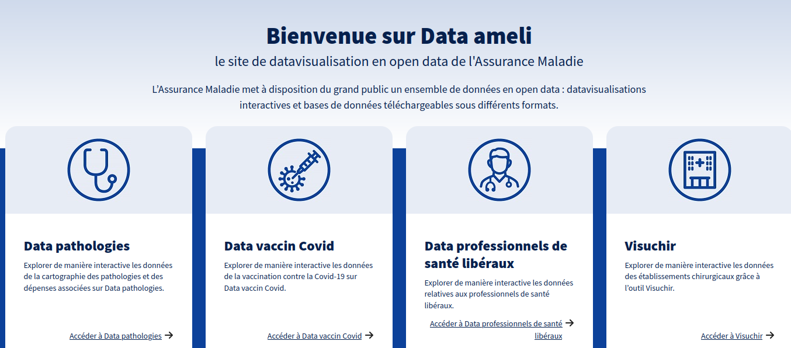
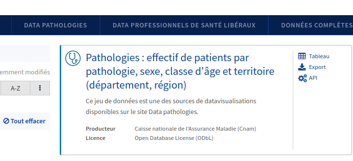
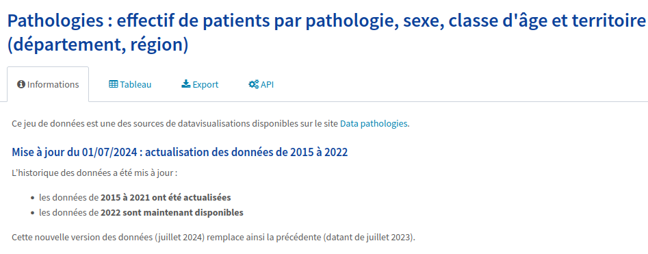
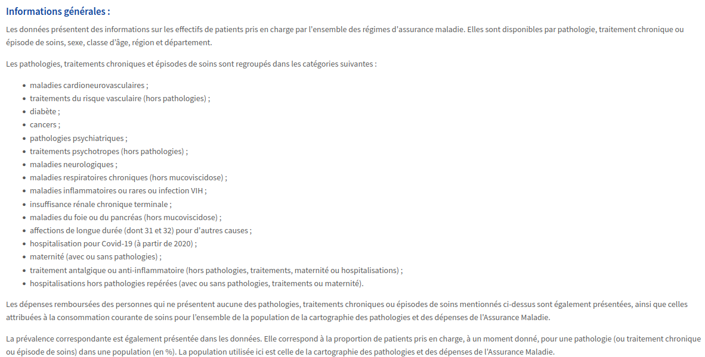

# Chapter 1: Ask

## 1. Contexte

J'ai choisi de réaliser une analyse exploratoire d'un jeu de données de la CPAM, qui met à disposition du public des jeux de données de santé en open data via leur site data.ameli.fr :

En cliquant sur la section '**Data pathologies**' du site de la CPAM, une page s'affiche :

> « L'Assurance Maladie met à disposition du grand public un ensemble de données sur une cinquantaine de pathologies, traitements chroniques et épisodes de soins : diabète, syndrome coronaire aigu, insuffisance cardiaque, AVC aigu, cancer du sein, cancer du poumon, maladie de Parkinson, épilepsie, mucoviscidose, traitements anxiolytiques, maternité, etc. Quels sont les effectifs de patients pris en charge pour ces différentes pathologies ? Comment évolue la prévalence ? Comment l'effectif est-il réparti sur le territoire français ? Quelles sont les dépenses remboursées affectées à chacune des pathologies identifiées ? »

Bien que de nombreux graphiques et visualisations interactives soient déjà disponibles sur cette page, je choisis de réaliser ma propre analyse exploratoire des données pour en faire une analyse personnalisée. Après un clic sur l'onglet '**Données complètes**', un jeu de données m'intéresse particulièrement :

Lorsque je clique dessus, les métadonnées indiquent qu'il s'agit d'un jeu de données couvrant les années 2015 à 2022, récemment actualisé en juillet 2024, ce qui est une bonne nouvelle :

Ce jeu de données concerne les effectifs de patients pris en charge par la CPAM selon les années, les pathologies, les tranches d'âge, le sexe et les territoires (régions et départements) :

## 2. Objectif de l'analyse

Mon but est d'analyser le jeu de données ci-dessus pour découvrir la répartition des pathologies selon les territoires (départements) et les facteurs démographiques (sexe, classe d'âge). Je souhaite également afficher l'évolution de ces maladies selon les années, de 2015 à 2022, en observant si les années post-Covid ont été impactées par la vague Covid de 2019-2020.

## 3. Questions clés

Voici les questions auxquelles je souhaite répondre :

* Comment sont réparties en 2022 (l'année la plus récente de ce jeu de données) des pathologies spécifiques (comme le cancer du poumon, le cancer colorectal, le diabète, …) parmi les départements français ?
* Comment la prévalence de ces pathologies a-t-elle évolué de 2015 à 2022 ?
* La vague de Covid-19 a-t-elle eu un impact sur la prévalence de ces pathologies dans les années post-Covid (2020-2022) ?
