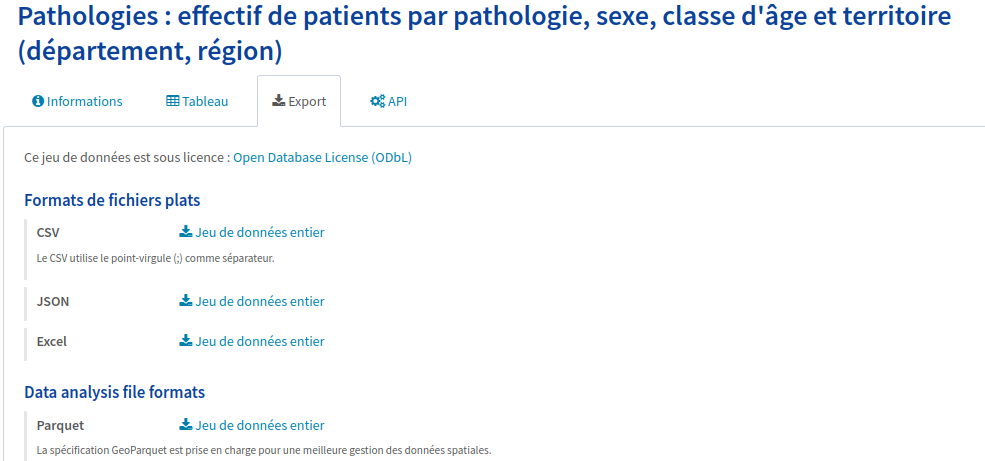
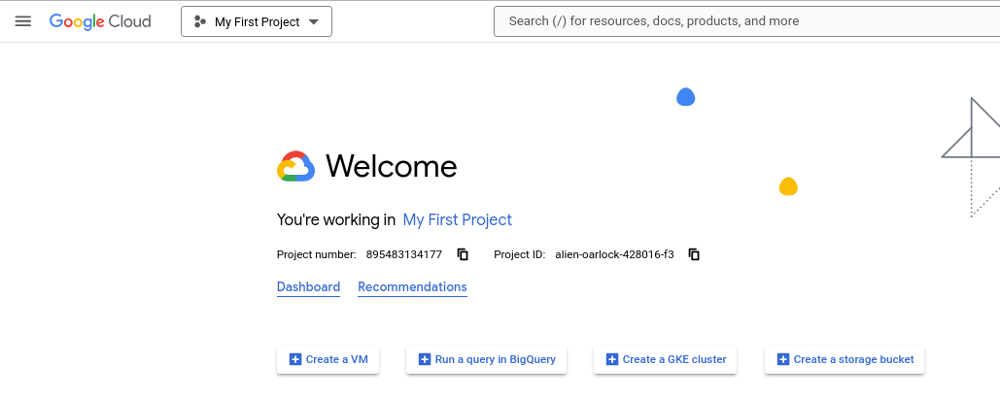
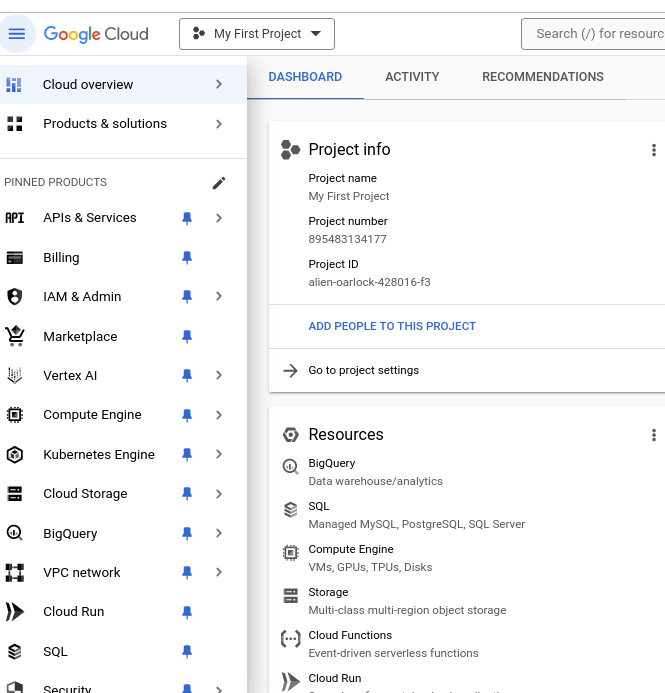
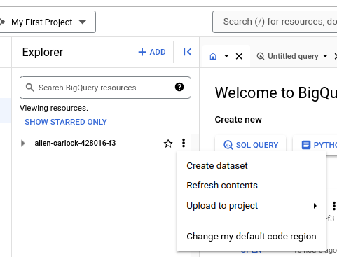
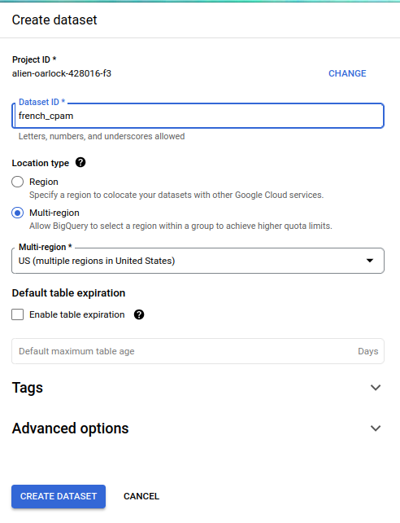
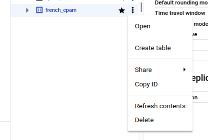
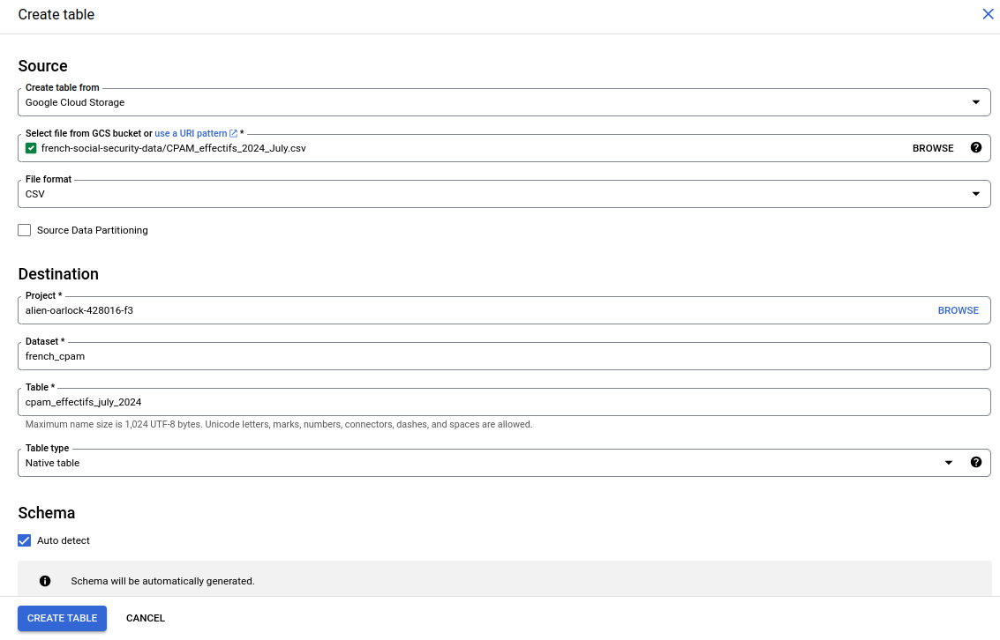

# Chapter 2: Prepare

## 1. Source de données

Le jeu de données de la CPAM est disponible dans différents formats, y compris CSV, JSON, Excel et Parquet. Je choisis le format CSV, car c'est celui qui m'est le plus familier.

## 2. Organisation des données

Le projet est géré dans un dépôt Git (`git-repos/data-analysis-cpam`) pour un bon contrôle de versions.

Le dépôt git `data-analysis-cpam` possède les sous-répertoires suivants :

- `R`: scripts R. 
- `Python`: scripts Python.
- `SQL`: requêtes SQL (dans BigQuery) utilisées pour l'extraction, le filtrage et la transformation des données.
- `CSV`: tous les fichiers CSV utilisés et générés durant l'analyse.
- `images`: toutes les visualisations et graphes générés durant le projet.

Des sous-répertoires complémentaires incluent :

- `DATA`: le jeu de données d'origine.
- `SCRIPTS`: tous les scripts utilisés dans le project, classés par langages (R, Python, SQL, shell).
- `IMAGES`: toutes les images générées pour l'analyse.
- `REPORTS`: Rapports générés à l'issue de l'analyse des données.

## 3. Préparation du jeu de données de la CPAM

Le fichier CSV fait presque 800 Mo, ce qui dépasse les capacités d'Excel ou de Google Sheets. Je préfère ne pas surcharger les ressources de mon propre ordinateur, aussi je décide d'aller sur Google Cloud Storage (GCS) pour stocker mon jeu de données. C'est la solution la plus pratique pour moi, car GSC se trouve dans la même plateforme Google Cloud que BigQuery, que j'ai déjà utilisé plusieurs fois. Après m'être inscrite sur Google Cloud Platform, je suis prête à commencer.

### Accès dans Google Cloud

Lorsque j'ouvre ma console Google, je vois que BigQuery et Cloud Storage sont tous deux situés dans le même panneau de navigation à gauche, aux côtés de SQL et de plusieurs autres services, ce qui est très pratique. Sur le côté droit de l'écran, je remarque que le système m'a attribué un nom de projet, `My First Project`, et un ID de projet étrangement nommé `alien-oarlock-428016-f3` :

Je transfère mon fichier CSV original, que j'ai nommé `CPAM_effectifs_2024_July.csv`, dans un nouveau "Bucket" que j'ai créé sur Google Cloud Storage. Ensuite, je dois le rendre accessible dans BigQuery pour l'analyse.

### Accès dans BigQuery

Je navigue vers l'interface de BigQuery et repère mon ID de projet, `alien-oarlock-428016-f3`, dans le panneau Explorer à gauche de l'écran. À côté de l'ID de projet, je clique sur le menu à trois points verticaux et sélectionne *'Create dataset'*.

Une fenêtre s'affiche, avec l'ID de projet déjà renseigné. Je tape `french_cpam` dans la zone de texte Dataset ID, et change `Location type` sur `Multi-region` / `EU (multiple regions in Europe)`.

Désormais, je vois que sous mon ID de projet, le dataset nouvellement créé `french_cpam` apparaît.

Ensuite, je clique à nouveau sur le menu à trois points verticaux, mais à côté de l'ID du dataset cette fois, et je sélectionne `Create table`.

Dans la fenêtre contextuelle qui s'affiche, je définis la source sur `Google Cloud Storage` et je recherche le fichier CSV que je viens de transférer. Dans la section de destination, l'ID de projet `alien-oarlock-428016-f3` et l'ID de dataset `french_cpam` sont déjà prédéfinis.
Je nomme la table `cpam_effectifs_july_2024` et sélectionne `Auto detect` pour laisser le système détecter automatiquement la structure de mon fichier, ce qui simplifie la configuration. Enfin, je clique sur `Create table` pour finaliser le processus :

Aïe. Un message d'erreur s'affiche :

> Failed to create table: Error while reading data, error message: CSV table encountered too many errors, giving up.
> Rows: 10600; errors: 100.
> Please look into the errors[] collection for more details.
> File: gs://french-social-security-data/CPAM_effectifs_2024_July.csv

Quand je reviens à mon fichier CSV, je réalise que le séparateur dans ce fichier est un point-virgule (`;`), et non la virgule (`,`) plus habituelle aux États-Unis.

En revenant à la fenêtre de création de table dans BigQuery, vers le bas de cette fenêtre, je vois un lien `Advanced options`. Lorsque j'agrandis cette section, un paramètre appelé  `Field delimiter` est prédéfini sur `Comma` (virgule). Si je fais défiler les options, je vois des choix comme `Tab`, `Pipe`, ou `Custom`. Choisissons `Custom` (personnalisé) et définissons le délimiteur sur le point-virgule.

Un message en rouge m'informe que le délimiteur personnalisé ne doit contenir qu'un seul caractère.

Je tape simplement le caractère du point-virgule, c'est-à-dire `;`.

Je clique à nouveau sur `Create Table`.  Ça marche ! BigQuery confirme : `cpam_effectifs_july_2024' created.`

Les données sont désormais prêtes pour la prochaine phase (Process / Cleaning).