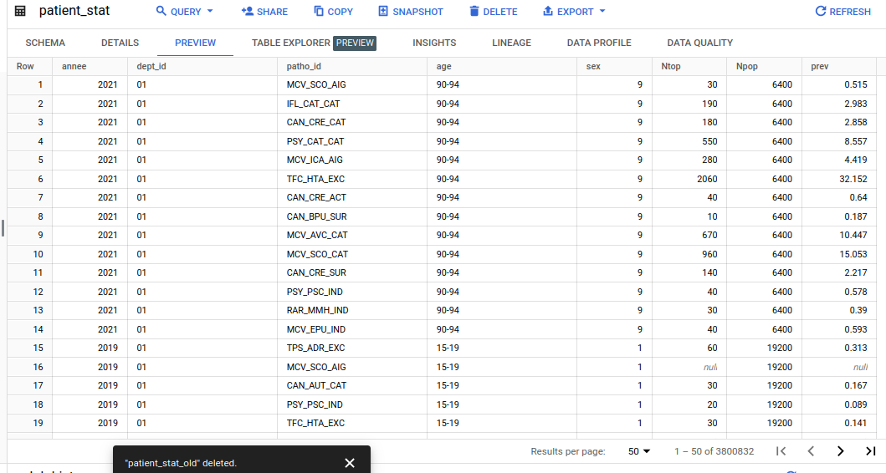

# Chapter 3: Process

## 1) Aperçu des données sur le site de la CPAM

Commençons par examiner le modèle de données et les 100 premières lignes de la table sur le site de la CPAM :


Sous le premier onglet `Informations`, si l'on fait défiler la page vers le bas jusqu'à `Modèle de données`, on obtient des informations sur les colonnes de la table et leur type de données.

Si l'on va sur le deuxième onglet `Tableau`, on peut visualiser les premières lignes du jeu de données :


On apprend ainsi que le jeu de données se compose d'une table avec une douzaine de colonnes :

Colonne | Description | Type   |
--------|-------------|--------|
`annee` | les années que couvre cette période d'analyse, qui s'étendent actuellement de 2015 à 2022. | date |
`patho_niv1`, `patho_niv2`, `patho_niv3` | groupe ou sous-groupe de pathologies (ou traitements chroniques ou épisodes de soins). | texte |
`top` | libellé technique de la pathologie. Ex. `CAN_CAT_CAT`. | texte |
`cla_age_5` | classe d'âge (tranche de 5 années). Ex : `30-34`. | texte |
`libelle_classe_age` | classe d'âge en toutes lettres, par ex. `de 30 à 34 ans`. | texte |
`sexe` | `1` pour homme, `2` pour femme, et `9` pour 'tous sexes'. | texte |
`libelle_sexe` | trois options : `homme`, `femme`, `tous sexes`. | texte |
`region` | code INSEE de chaque région française. Le code `99` signifie `toutes régions`. | int |
`dept` | code INSEE de chaque département. Le code `999` signifie `tous départements`. | texte |
`Ntop` | effectif de patients pris en charge pour la pathologie (ou traitement chronique ou épisode de soins) dont il est question. | int |
`Npop` | population de référence qui est celle de la cartographie des pathologies et des dépenses de l'Assurance Maladie. | int |
`prev` | prévalence de patients pris en charge pour la pathologie (ou traitement chronique ou épisode de soins) dont il est question. Ex. `0.867`. | décimal |

À noter, les valeurs de la colonne `dpt` sont de type texte en raison des départements de la Corse, `2A` et `2B`.

### Rappel sur la notion de prévalence

La prévalence fait référence à la proportion d'individus dans une population qui ont une maladie ou un problème de santé spécifique, au cours d'une période donnée. La prévalence englobe aussi bien les nouveaux cas que les cas déjà déclarés.

Contrairement à l'incidence (qui mesure uniquement le taux de nouveaux cas), la prévalence dépend de la durée de la maladie.

Dans ce jeu de données, le champ `prev` représente la prévalence, calculée comme le ratio de `Ntop` (le nombre de personnes recevant des soins pour une pathologie spécifique) sur `Npop` (la population de référence pour cette pathologie) :

```math
prévalence=\frac{Ntop}{Npop}
```

C'est pourquoi le champ de prévalence `prev` a un type de données 'float' ou décimal, ce qui signifie qu'il s'agit d'une valeur décimale.

Par exemple, si 3 000 personnes reçoivent des soins pour des troubles psychiatriques au cours d'une année donnée dans une région spécifique avec une population de référence de 100 000 personnes, la prévalence serait :

```math
prev=\frac{3\ 000}{100\ 000}=0,03\ ou\ 3\%
```


## 2) Exploration dans BigQuery avec SQL

Après avoir inspecté les premières lignes du jeu de données sur le site de la CPAM, je continue désormais mon exploration dans BigQuery, pour avoir un meilleur contrôle.

### Comprendre la structure de BigQuery

Pour exécuter des requêtes SQL dans BigQuery, il faut donner le chemin complet des tables, à savoir :

-  **L'ID du projet** : Chaque projet dans BigQuery possède un identifiant unique. Comme mentionné précédemment, l'ID de projet attribué ici par BigQuery est `alien-oarlock-428016-f3`.
-  **L'ID du dataset** : Au sein de chaque projet, vous pouvez avoir plusieurs ensembles de données (*datasets*). Un *dataset* est comme un conteneur qui stocke vos tables. Pour ce projet, j'ai créé un ensemble de données appelé `french_cpam`.
-  **Le nom de la table** : Au sein du *dataset*, les données sont stockées dans des tables. Ma table s'appelle `cpam_effectifs_july_2024`.


Après ces précisions, commençons à lancer des requêtes exploratoires dans BigQuery.

### Taille du jeu de données

Voyons la taille du jeu de données :

```sql
SELECT
    COUNT(*) AS `Number of rows`
FROM
    `alien-oarlock-428016-f3.french_cpam.cpam_effectifs_july_2024`;
```

Résultats :

Row   | Number of rows |
----- | -------------- |
 1    | 4636800        |

Il y a donc plus de 4 millions de lignes dans mon jeu de données (précisément 4 636 800 lignes). Ce volume important de données me conforte dans mon choix d'avoir utilisé une plateforme robuste comme BigQuery, qui peut gérer de larges ensembles de données.

La taille imposante de cette table monolithique me fait songer à la diviser en tables plus petites et plus faciles à gérer, dans un souci de normalisation et d'optimisation des requêtes. Mais pour l'instant, terminons les requêtes de base.

### Nombre de colonnes

Voyons le nombre de colonnes de la table `cpam_effectifs_july_2024`, selon la formule :

```sql
SELECT
    COUNT(*)
FROM
    INFORMATION_SCHEMA.COLUMNS
WHERE
    table_name = [my_table_name]
```

Toutefois, comme on l'a vu dans BigQuery, je dois inclure l'ID du projet et l'ID du dataset ID avant `INFORMATION_SCHEMA.COLUMNS` :

```sql
SELECT
    COUNT(*) AS number_of_columns
FROM
    alien-oarlock-428016-f3.french_cpam.INFORMATION_SCHEMA.COLUMNS
WHERE
    table_name = 'cpam_effectifs_july_2024';
```

Résultats :

Row  | number_of_columns |
---- | ---- |
1    | 16 |

La table contient 16 colonnes, ce qui me paraît beaucoup. Pour vérifier, affichons le nom de toutes les colonnes :

```sql
SELECT
    column_name
FROM
    alien-oarlock-428016-f3.french_cpam.INFORMATION_SCHEMA.COLUMNS
WHERE
    table_name = 'cpam_effectifs_july_2024'
```

Résultats :

Row  | annee |
---- | ---- |
 2   | patho niv1 |
 3   | patho niv2 |
 4   | patho niv3 |
 5   | top |
 6   | cla_age_5 |
 7   | sexe |
 8   | region |
 9   | dept |
 10  | Ntop |
 11  | Npop |
 12  | prev |
 13  | Niveau prioritaire |
 14  | libelle classe age |
 15  | libelle_sexe |
 16  | tri |

Ce résultat correspond à ce qui est affiché sur le site de la CPAM, donc tout est correct. 

Cependant, pour mon projet d'analyse, certaines colonnes ne sont pas pertinentes, à savoir :

* `Niveau prioritaire` (Ex : 1, 2, 3) : aucune explication supplémentaire
* `tri` (Ex. 8) : aucune explication supplémentaire sur le site de la CPAM
* `libelle classe age` (Ex. '30 à 34 ans') : cela n'apporte rien par rapport à `cla_age_5` (Ex. '30-34)
* `region` : je préfère enlever cette colonne pour me concentrer sur les départements et avoir une granularité plus fine


### Aperçu des cent premières lignes

```sql
SELECT
    *
FROM
    alien-oarlock-428016-f3.french_cpam.cpam_effectifs_july_2024
LIMIT 100;
```

Résultats:

L'aperçu des données révèle des points intéressants. Notamment, les 3 colonnes des pathologies (niveau 1, 2 et 3) contiennent deux valeurs qui attirent mon attention :

* `Pas de pathologie repérée, traitement, maternité, hospitalisation ou traitement antalgique ou anti-inflammatoire` : ça semble indiquer des enregistrements où aucune pathologie ni aucun type de traitement n'a été nécessaire.
* `Total consommants tous régimes` : cela semble représenter le total de tous les bénéficiaires du système de santé en France, tous régimes confondus. Cela ne spécifie pas une pathologie particulière, mais semble plutôt agréger les données pour toutes les pathologies. Pour ces entrées, les champs `Ntop` (nombre de patients traités) et `Npop` (population de référence) affichent le même nombre (10 970) pour le groupe d'âge 0-4 ans, aboutissant à un taux de prévalence calculé de 100 %.

De manière similaire à d'autres indicateurs agrégés (comme `9` représentant `tous sexes`, `999` pour `tous départements`, et `99` pour `toutes les régions`), la valeur `Total consommants tous régimes` dans les colonnes de pathologie semble représenter un récapitulatif pour l'ensemble de la population.

Ainsi donc, **certaines lignes agrègent les données** plutôt que d'afficher des enregistrements individuels. C'est important à noter, car il ne faut pas de doublons lors de l'analyse des données, sous peine d'avoir des résultats faussés.

Pour m'assurer que je comprends bien ces entrées, je lance les requêtes SQL suivantes, en mentionnant spécifiquement les valeurs agrégées du sexe (`9`), des départements (`999`), des régions (`99`), des groupes d'âge (`tsage`), ainsi qu'une année donnée (`2022`), afin d'éviter toute duplication de données :

```sql
-- Ntop for 'Pas de pathologie repérée, traitement, maternité, hospitalisation ou traitement antalgique ou anti-inflammatoire' for the year 2022 and all ages
SELECT
    SUM(Ntop) AS sum_no_pathology
FROM
    `alien-oarlock-428016-f3.french_cpam.cpam_effectifs_july_2024`
WHERE
    patho_niv1 = 'Pas de pathologie repérée, traitement, maternité, hospitalisation ou traitement antalgique ou anti-inflammatoire'
    AND sexe = 9
    AND dept = '999'
    AND region = 99
    AND cla_age_5 = 'tsage'
    AND annee = 2022;
```

```sql
-- Ntop for 'Total consommants tous régimes' for the year 2022 and all ages
SELECT
    SUM(Ntop) AS sum_total_consumers
FROM
    `alien-oarlock-428016-f3.french_cpam.cpam_effectifs_july_2024`
WHERE
    patho_niv1 = 'Total consommants tous régimes'
    AND sexe = 9
    AND dept = '999'
    AND region = 99
    AND cla_age_5 = 'tsage'
    AND annee = 2022;
```

**Résultats:**

Résultats    | Valeurs |
-----------|----|
37 919 240 | `sum_no_pathology` |
68 729 230 | `sum_total_consumers` |

La valeur des `total consommants tous régimes` semble exacte, car le site de la CPAM rapporte « 68,7 millions de bénéficiaires de soins de santé en France pour 2022 ».

La valeur de quasi 38 millions de personnes sans pathologie en 2022 (c'est-à-dire plus d'une personne sur deux en France) semble plausible, bien que cela me surprenne quelque peu. Je pourrais approfondir cette analyse plus tard pour valider cette conclusion.

Globalement, les résultats des données semblent cohérents.

### Recherche des valeurs nulles

Voyons s'il y a des valeurs nulles dans la table `cpam_effectifs_july_2024`:

```sql
SELECT
    COUNTIF(patho_niv1 IS NULL) AS Missing_Patho1,
    COUNTIF(patho_niv2 IS NULL) AS Missing_Patho2,
    COUNTIF(patho_niv3 IS NULL) AS Missing_Patho3,
    COUNTIF(annee IS NULL) AS Missing_Year,
    COUNTIF(sexe IS NULL) AS Missing_Sexe,
    COUNTIF(cla_age_5 IS NULL) AS Missing_Age_Group,
    COUNTIF(Ntop IS NULL) AS Missing_Patients,
    COUNTIF(Npop IS NULL) AS Missing_Population,
    COUNTIF(dept IS NULL) AS Missing_Department,
    COUNTIF(region IS NULL) AS Missing_Region
FROM
    alien-oarlock-428016-f3.french_cpam.cpam_effectifs_july_2024
```

**Résultats** :

Je trouve des valeurs nulles principalement dans les colonnes `patho_nov2` (483 840 occurrences) et `patho_nov3` (1 048 320 occurrences), ce qui suggère que certaines `patho_niv1` ne se divisent pas en sous-catégories.

La colonne `Ntop` (nombre de patients) contient également de nombreux nulls : précisément 1 238 024 nulls. Ce grand nombre m'interpelle. Pour en savoir plus, je lance la requête suivante pour examiner les 100 premières lignes où `Ntop` est nul, et vérifie les valeurs des autres colonnes dans ces lignes :

```sql
SELECT
    *
FROM
    alien-oarlock-428016-f3.french_cpam.cpam_effectifs_july_2024
WHERE
    Ntop IS NULL
LIMIT 100
```

**Résultats:**

Les résultats sont révélateurs. Les cent premières lignes avec une valeur nulle dans la colonne `Ntop` (indiquant l'absence de patients) correspondent au groupe d'âge très jeune de 0 à 4 ans, sans cas de cancer enregistrés. Cela reflète la réalité que certaines pathologies sont absentes ou extrêmement rares dans certaines tranches démographiques, comme certains groupes d'âge ou sexes. Cela a du sens et me rassure sur le fait que ces valeurs nulles indiquent probablement une faible prévalence ou l'absence de ces pathologies, plutôt que des données manquantes.

Pour confirmer mon hypothèse et obtenir une vue plus large, je lance la requête suivante :

```sql
SELECT
    cla_age_5,
    sexe,
    patho_niv1,
    patho_niv2,
    COUNT(*) AS Count_of_Null_Ntop
FROM
    alien-oarlock-428016-f3.french_cpam.cpam_effectifs_july_2024
WHERE
    Ntop IS NULL
GROUP BY
    cla_age_5,
    sexe,
    patho_niv1,
    patho_niv2
ORDER BY
    Count_of_Null_Ntop DESC
```

**Résultats:**


Les résultats montrent des tendances pour lesquelles certains groupes d'âge, comme les très jeunes ou les très âgés, n'ont aucun cas enregistré pour certaines pathologies, telles que des maladies inflammatoires ou des cancers. De plus, certains sexes n'ont pas de cas enregistrés pour des conditions spécifiques, comme les patients masculins pour le cancer du sein féminin. Ces résultats renforcent mon idée que les valeurs nulles dans `Ntop` (nombre de patients) sont cohérentes avec les tendances démographiques attendues de la prévalence des maladies.

Pour garantir l'intégrité des données, je vérifie que le nombre total de valeurs nulles identifiées dans la requête précédente correspond bien aux 1 238 024 valeurs nulles de `Ntop` que nous avons trouvées plus tôt. Au passage, cela me permet d'utiliser une sous-requête imbriquée dans une requête :

```sql
SELECT
    SUM(Count_of_Null_Ntop) AS Total_Null_Ntop
FROM
    (
        SELECT
            cla_age_5,
            sexe,
            patho_niv1,
            patho_niv2,
            COUNT(*) AS Count_of_Null_Ntop
        FROM
            alien-oarlock-428016-f3.french_cpam.cpam_effectifs_july_2024
        WHERE
            Ntop IS NULL
        GROUP BY
            cla_age_5,
            sexe,
            patho_niv1,
            patho_niv2
    ) AS my_temp_table;
```

Le résultat est conforme aux attentes :

Row | Total_Null_Ntop |
----|---------|
1   | 1238024 |

Comme prévu, nous obtenons 1 238 024 valeurs nulles pour `Ntop`. L'intégrité des données semble assurée.


## 3) Nettoyage et filtrage de la table initiale

Avant de procéder à l'analyse, je vais filtrer les données non pertinentes que nous avons identifiées précédemment, à savoir les colonnes `Niveau prioritaire`, `Tri`, `Libellé classe d'âge` et `region`.

Attention ! Comme la colonne `region` contient des valeurs agrégées (99 pour `toutes régions`, il faut que je fasse attention à ne pas avoir des lignes doublons qui restent lorsque je crée une nouvelle table sans la colonne `region`.

Aussi, comme on l'a vu, certaines lignes de la colonne `patho_niv1` contiennent les valeurs `Pas de pathologie repérée, traitement, maternité, hospitalisation ou traitement antalgique ou anti-inflammatoire` et `Total consommants tous régimes` qui ne sont pas pertinentes pour mon analyse et vont également être exclues.

Voici ma requête SQL sur BiqQuery pour créer la table `cleaned_cpam` :

```sql
-- Création de la table 'cleaned_cpam' 

CREATE OR REPLACE
TABLE `alien-oarlock-428016-f3.french_cpam.cleaned_cpam` AS

SELECT
    annee,
    top,
    patho_niv1,
    patho_niv2,
    patho_niv3,
    dept,
    cla_age_5,
    sexe,
    Ntop,
    Npop,
    prev
FROM
    `alien-oarlock-428016-f3.french_cpam.cpam_effectifs_july_2024`
WHERE
    patho_niv1 NOT LIKE "%Pas de patho%"
    AND patho_niv1 NOT LIKE "%Total conso%"
    AND region != 99 -- attention à enlever les lignes des régions aggrégées
```

### Table `cleaned_cpam` nettoyée :


Quand je clique sur `Preview`, je constate que la table `cleaned_cpam` contient désormais 4.478.208 lignes, soit environ deux cents mille lignes de moins que la table initiale de 4.636.840 lignes. Ce filtrage permet d’obtenir une table plus petite et mieux ciblée pour mon analyse.


Je vérifie quand même que les lignes contenant `Total consommants` ou `Pas de pathologies` dans la colonne `patho_niv1` ont bien été exclues :


## 4) Division de `cleaned_cpam` en trois tables pour une meilleure gestion et normalisation

Bien que ma nouvelle table `cleaned_cpam` soit plus petite, elle reste monolithique et difficile à manipuler directement. Pour optimiser l'organisation des données et tendre vers une meilleure normalisation, je vais scinder `cleaned_cpam` en plusieurs tables. Cette approche rendra mes requêtes SQL un tout petit peu plus longues à cause des jointures, mais cela va éviter les redondances et rendre mes analyses plus claires.

Comme c'est généralement le cas dans le domaine de la santé, les données sont agrégées et anonymisées, c'est pourquoi une table sera `patient_stat`.

À noter, les pathologies semblent hiérarchisées (niveaux 1, 2 et 3), donc idéalement il devrait y avoir un champ `parent_id` pour représenter cette relation dans la table des pathologies. Cependant, (alerte spoiler) j'ai essayé de mettre en place une structure hiérarchique pendant plusieurs jours, sans succès. Je me résous donc à créer une table `patho` avec une structure plate, tout comme la CPAM l'a fait.

Le libellé technique contenu dans la colonne `top` initiale (par ex. `CAN_BPU_SUR` pour "cancer bronchopulmonaire sous surveillance") semble être unique à chaque combinaison de pathologie, catégorie et sous-catégorie. Je vais donc l'utiliser comme clé primaire dans ma table `patho`.

Notez que j'aurais aussi pu créer des tables séparées pour l'âge et le sexe si j'avais plusieurs colonnes associées, comme dans le jeu initial des données (Ex. `cla_age_5` et `libelle_classe_age` pour la table `age`, ainsi que `sexe` et `libelle_sexe` pour la table `sex`). Mais je n'ai gardé qu'une seule colonne pour chaque table, donc cela n'a pas de sens de créer une table qui ne contient qu'une seule colonne, surtout si ces informations ne sont pas susceptibles de s'étendre dans le futur.


### Structure de la nouvelle base de données

#### a) Table `patho`

Colonne | Description | Type   |
--------|-------------|--------|
`id` (Clé primaire) | Équivalent à '`top`' du jeu de données initial. | texte |
`patho_niv1` | Équivalent à '`patho_niv1`' du jeu de données initial.  | texte |
`patho_niv2` | Équivalent à '`patho_niv2`' du jeu de données initial.  | texte |
`patho_niv3` | Équivalent à '`patho_niv3`' du jeu de données initial.  | texte |


#### b) Table `dept`

Colonne | Description | Type   |
--------|-------------|--------|
`id` (Clé primaire) | Équivalent à '`dept`' du jeu de données initial. Code à 2 ou 3 chiffres. Ex. “40” pour les Landes, “2A” pour la Corse-du-Sud, “974” pour l'île de la Réunion, “99” pour tous départements confondus. | texte |
`nom_dept` | Nom en toutes lettres du département. Ex. “Landes”. Les valeurs sont à créer car elles n'existent pas dans le jeu initial. | texte |


#### c) Table `patient_stat`

Colonne | Description | Type   |
--------|-------------|--------|
`annee` | Équivalent à '`annee`' du jeu de données initial. | entier |
`dept_id` (FK) | Foreign Key vers '`id`' dans la table `dept`. | texte |
`patho_id` (FK) | Foreign Key vers '`id`' de la table `patho`. | texte |
`age`  | Équivalent à '`cla_age_5`' du jeu de données initial. Ex. "30-34". | texte |
`sex ` | Équivalent à '`sexe`' du jeu de données initial. Ex. 1 pour homme, 2 pour femme, 9 pour tous sexes. | entier |
`Ntop` | Équivalent à '`Ntop`' du jeu de données initial. Nombre de patients traités pour une pathologie spécifique. | entier |
`Npop` | Équivalent à '`Npop`' du jeu de données initial. Base de population utilisée pour les calculs de prévalence. | entier |
`prev` | Équivalent à '`prev`' du jeu de données initial. Prévalence indiquée en pourcentage pour une pathologie donnée. | décimal |


### Requêtes SQL pour créer et remplir mes tables :

#### a) Table `patho`

``` sql
-- Création et insertion dans la table patho en une seule requête
CREATE TABLE `alien-oarlock-428016-f3.french_cpam.patho` AS
SELECT
   top AS id,  -- Utilisation de 'top' comme identifiant (Primary Key)
   patho_niv1,
   patho_niv2,
   patho_niv3
FROM `alien-oarlock-428016-f3.french_cpam.cleaned_cpam`
GROUP BY top, patho_niv1, patho_niv2, patho_niv3;  -- GROUP BY pour éviter les doublons
```

La table `patho` est bien créée avec 4 colonnes et 77 lignes.


#### b) Table `dept`

La table `dept` va être créée en plusieurs étapes, car la colonne `nom_dept` est nouvelle et va être remplie par les noms en toutes lettres des départements. Je fais cela en prévision des visualisation futures dans Tableau et Power BI. Spoiler : on peut avoir de gros soucis avec les cartes géographiques dans Tableau et BigQuery si on n'explicite pas clairement les codes géographiques dans ces plateformes.


- Création de la table `dept` avec deux colonnes  `id` et `nom_dept`

``` sql
--- Création de la table dept avec deux colonnes
CREATE TABLE `alien-oarlock-428016-f3.french_cpam.dept` (
    id STRING NOT NULL,       -- 'dept' de la table cleaned_cpam devient 'id' ici
    nom_dept                  -- 'pour le nom en toutes lettres du département
);

```

- Insertion des id uniques depuis la table `cleaned_cpam` :

``` sql 
-- Insertion des identifiants de départements (sans doublons) dans la table dept
INSERT INTO `alien-oarlock-428016-f3.french_cpam.dept` (id)
SELECT DISTINCT
    dept
FROM `alien-oarlock-428016-f3.french_cpam.cleaned_cpam`;

```


- Ajout des noms des départements dans la colonne `nom_dept` :

```sql
-- Mise à jour des noms de départements dans la table dept
-- Mise à jour des noms de départements dans la table dept
UPDATE `alien-oarlock-428016-f3.french_cpam.dept`
SET nom_dept = CASE id
    WHEN "01" THEN "Ain"
    WHEN "02" THEN "Aisne"
    WHEN "03" THEN "Allier"
    WHEN "04" THEN "Alpes-de-Haute-Provence"
    WHEN "05" THEN "Hautes-Alpes"
    WHEN "06" THEN "Alpes-Maritimes"
    WHEN "07" THEN "Ardèche"
    WHEN "08" THEN "Ardennes"
    WHEN "09" THEN "Ariège"
    WHEN "10" THEN "Aube"
    WHEN "11" THEN "Aude"
    WHEN "12" THEN "Aveyron"
    WHEN "13" THEN "Bouches-du-Rhône"
    WHEN "14" THEN "Calvados"
    WHEN "15" THEN "Cantal"
    WHEN "16" THEN "Charente"
    WHEN "17" THEN "Charente-Maritime"
    WHEN "18" THEN "Cher"
    WHEN "19" THEN "Corrèze"
    WHEN "21" THEN "Côte-d'Or"
    WHEN "22" THEN "Côtes-d'Armor"
    WHEN "23" THEN "Creuse"
    WHEN "24" THEN "Dordogne"
    WHEN "25" THEN "Doubs"
    WHEN "26" THEN "Drôme"
    WHEN "27" THEN "Eure"
    WHEN "28" THEN "Eure-et-Loir"
    WHEN "29" THEN "Finistère"
    WHEN "2A" THEN "Corse-du-Sud"
    WHEN "2B" THEN "Haute-Corse"
    WHEN "30" THEN "Gard"
    WHEN "31" THEN "Haute-Garonne"
    WHEN "32" THEN "Gers"
    WHEN "33" THEN "Gironde"
    WHEN "34" THEN "Hérault"
    WHEN "35" THEN "Ille-et-Vilaine"
    WHEN "36" THEN "Indre"
    WHEN "37" THEN "Indre-et-Loire"
    WHEN "38" THEN "Isère"
    WHEN "39" THEN "Jura"
    WHEN "40" THEN "Landes"
    WHEN "41" THEN "Loir-et-Cher"
    WHEN "42" THEN "Loire"
    WHEN "43" THEN "Haute-Loire"
    WHEN "44" THEN "Loire-Atlantique"
    WHEN "45" THEN "Loiret"
    WHEN "46" THEN "Lot"
    WHEN "47" THEN "Lot-et-Garonne"
    WHEN "48" THEN "Lozère"
    WHEN "49" THEN "Maine-et-Loire"
    WHEN "50" THEN "Manche"
    WHEN "51" THEN "Marne"
    WHEN "52" THEN "Haute-Marne"
    WHEN "53" THEN "Mayenne"
    WHEN "54" THEN "Meurthe-et-Moselle"
    WHEN "55" THEN "Meuse"
    WHEN "56" THEN "Morbihan"
    WHEN "57" THEN "Moselle"
    WHEN "58" THEN "Nièvre"
    WHEN "59" THEN "Nord"
    WHEN "60" THEN "Oise"
    WHEN "61" THEN "Orne"
    WHEN "62" THEN "Pas-de-Calais"
    WHEN "63" THEN "Puy-de-Dôme"
    WHEN "64" THEN "Pyrénées-Atlantiques"
    WHEN "65" THEN "Hautes-Pyrénées"
    WHEN "66" THEN "Pyrénées-Orientales"
    WHEN "67" THEN "Bas-Rhin"
    WHEN "68" THEN "Haut-Rhin"
    WHEN "69" THEN "Rhône"
    WHEN "70" THEN "Haute-Saône"
    WHEN "71" THEN "Saône-et-Loire"
    WHEN "72" THEN "Sarthe"
    WHEN "73" THEN "Savoie"
    WHEN "74" THEN "Haute-Savoie"
    WHEN "75" THEN "Paris"
    WHEN "76" THEN "Seine-Maritime"
    WHEN "77" THEN "Seine-et-Marne"
    WHEN "78" THEN "Yvelines"
    WHEN "79" THEN "Deux-Sèvres"
    WHEN "80" THEN "Somme"
    WHEN "81" THEN "Tarn"
    WHEN "82" THEN "Tarn-et-Garonne"
    WHEN "83" THEN "Var"
    WHEN "84" THEN "Vaucluse"
    WHEN "85" THEN "Vendée"
    WHEN "86" THEN "Vienne"
    WHEN "87" THEN "Haute-Vienne"
    WHEN "88" THEN "Vosges"
    WHEN "89" THEN "Yonne"
    WHEN "90" THEN "Territoire de Belfort"
    WHEN "91" THEN "Essonne"
    WHEN "92" THEN "Hauts-de-Seine"
    WHEN "93" THEN "Seine-Saint-Denis"
    WHEN "94" THEN "Val-de-Marne"
    WHEN "95" THEN "Val-d'Oise"
    WHEN "971" THEN "Guadeloupe"
    WHEN "972" THEN "Martinique"
    WHEN "973" THEN "Guyane"
    WHEN "974" THEN "La Réunion"
    WHEN "976" THEN "Mayotte"
    WHEN "999" THEN "Tous départements"
    ELSE nom_dept
END
WHERE id IS NOT NULL; -- Condition à rajouter pour satisfaire la clause WHERE
```

La table `dept` est bien créée avec 2 colonnes et 102 lignes.
Les départements français sont au nombre de 101 (métrople et outremer), et si l'on ajoute la ligne pour l'aggrégation des départements (code 999), cela fait bien 101 + 1 = 102. Donc tout est OK. 


Pour une vérification supplémentaire, j'ai aussi fait un ORDER BY id pour classer les départements dans l'odre croissant, et j'ai bien trouvé dans la table les deux départements de Corse, les 5 départements d’Outre-mer et le département fictif ‘999’ agrégeant tous les départements. 
L'intégrité des données semble assurée.


#### c) Table `patient_stat`

Ici je passe par deux étapes pour m'assurer que je fais bien la jointure avec les deux autres tables nouvellement créées `patho` et `dept` :


``` sql
-- Création de la table patient_stat

CREATE OR REPLACE TABLE alien-oarlock-428016-f3.french_cpam.patient_stat (
 annee INT64,
 dept_id STRING,  -- Foreign Key vers la table dept
 patho_id STRING,  -- Foreign Key vers la table patho
 age STRING,  -- classe d'âge
 sex INT64,  -- sexe (1 pour homme, 2 pour femme, 9 pour tous)
 Ntop INT64,
 Npop INT64,
 prev FLOAT64
);
```

``` sql
-- Insertion des données dans la table patient_stat avec jointures pour assurer l'intégrité des clés étrangères
INSERT INTO `alien-oarlock-428016-f3.french_cpam.patient_stat` (annee, dept_id, patho_id, age, sex, Ntop, Npop, prev)
SELECT
    cleaned.annee,
    dept.id AS dept_id,  -- Jointure avec la table dept pour obtenir l'ID du département
    patho.id AS patho_id,  -- Jointure avec la table patho pour obtenir l'ID de la pathologie (top)
    cleaned.cla_age_5 AS age,
    cleaned.sexe AS sex,
    cleaned.Ntop,
    cleaned.Npop,
    cleaned.prev
FROM `alien-oarlock-428016-f3.french_cpam.cleaned_cpam` AS cleaned
JOIN `alien-oarlock-428016-f3.french_cpam.patho` AS patho
    ON cleaned.top = patho.id  -- Jointure sur la clé top pour assurer la correspondance avec patho_id
JOIN `alien-oarlock-428016-f3.french_cpam.dept` AS dept
    ON cleaned.dept = dept.id;  -- Jointure sur le code département pour assurer la correspondance avec dept_id

```


La table `patient_stat` est bien créée avec 8 colonnes et 4.478.208 lignes. Elle contient des valeurs Null dans les colonnes `Ntop` et `prev`, comme attendu.

Le nombre de rangées correspond à celui de la table `cleaned_cpam`, donc tout semble correct.





Mes trois tables sont bien créées et remplies. 

Maintenant que j'ai filtré et organisé les données en fonction de mon objectif d'analyse, je vais les examiner plus en profondeur et procéder à l'analyse proprement dite dans la prochaine (Analysis).
