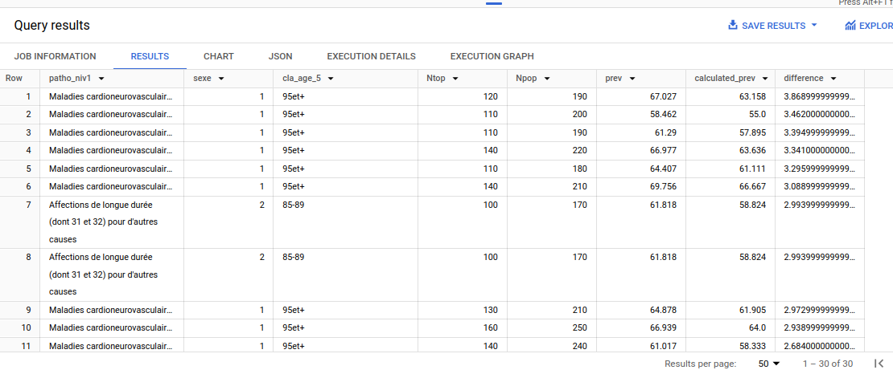
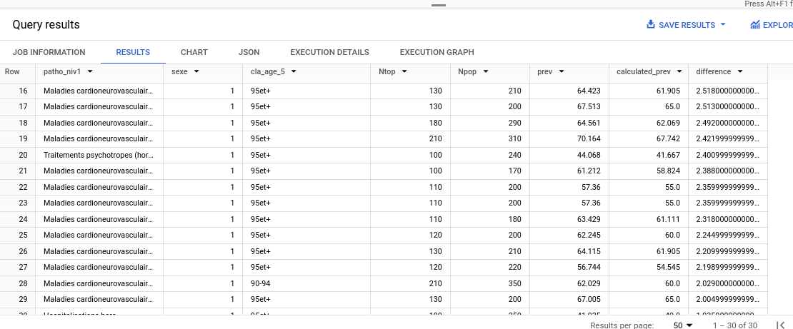

# Chapter 4: Analysis

Maintenant que mes données ont été nettoyées et organisées dans BigQuery, il est temps de passer à l'analyse proprement dite. 


## 1) Répartition des données

Je souhaite afficher toutes les valeurs distinctes présentes dans chaque colonne clé, comme les colonnes de pathologies, régions, départements et groupes d'âge.

Commençons par `patho_niv1` pour lister toutes les pathologies distinctes de niveau 1:

```sql
SELECT
    DISTINCT patho_niv1
FROM
    alien-oarlock-428016-f3.french_cpam.cleaned_cpam;
```

**Résultats:**

Row | patho_niv1 |
--- | ----- |
1   | Affections de longue durée (dont 31 et 32\) pour d'autres causes |
2   | Cancers |
3   | Diabète |
4   | Hospitalisations hors pathologies repérées (avec ou sans pathologies, traitements ou maternité) |
5   | Maladies inflammatoires ou rares ou infection VIH |
6   | Hospitalisation pour Covid-19 |
7   | Insuffisance rénale chronique terminale |
8   | Maternité (avec ou sans pathologies) |
9   | Maladies cardioneurovasculaires |
10  | Maladies du foie ou du pancréas (hors mucoviscidose) |
11  | Maladies neurologiques |
12  | Maladies psychiatriques |
13  | Maladies respiratoires chroniques (hors mucoviscidose) |
14  | Traitement antalgique ou anti-inflammatoire (hors pathologies, traitements, maternité ou hospitalisations) |
15  | Traitements du risque vasculaire (hors pathologies) |
16  | Traitements psychotropes (hors pathologies) |

Il y a ainsi 16 entrées distinctes pour `patho_niv1`.

Les requêtes sur le reste de mes colonnes clés sont les suivantes :

```sql
SELECT
    DISTINCT patho_niv2
FROM
    `alien-oarlock-428016-f3.french_cpam.cleaned_cpam`;

SELECT
    DISTINCT patho_niv3
FROM
    `alien-oarlock-428016-f3.french_cpam.cleaned_cpam`;

SELECT
    DISTINCT dept
FROM
    `alien-oarlock-428016-f3.french_cpam.cleaned_cpam`;

SELECT
    DISTINCT region
FROM
    `alien-oarlock-428016-f3.french_cpam.cleaned_cpam`;

SELECT
    DISTINCT cla_age_5
FROM
    `alien-oarlock-428016-f3.french_cpam.cleaned_cpam`;
```

**Résultats** :

49 lignes pour le niveau de pathologie 2, avec une ligne contenant une valeur Null, ce qui donne **48 lignes valides pour `patho_niv2`. Cela correspond aux 48 lignes pour toutes les pathologies listées dans `patho_niv2` sur le site de la CPAM, donc tout va bien.

62 lignes pour le niveau de pathologie 3, avec une ligne contenant une valeur Null, ce qui donne `61 lignes valides pour patho_niv3`. Cela correspond aux 61 lignes pour toutes les pathologies listées dans `patho_niv3` sur le site de la CPAM, donc tout est correct.

Remarque : les valeurs Null pour les niveaux de pathologie 2 et 3 signifient probablement que certaines pathologies au niveau 1 n'ont pas de sous-catégories.

Pour récapituler, il y a :

* 18 lignes valides pour le niveau de pathologie 1.
* 48 lignes valides pour le niveau de pathologie 2.
* 61 lignes valides pour le niveau de pathologie 3.
* 102 lignes pour les départements français, ce qui inclut la valeur agrégée `999` (pour tous les départements). À ma connaissance, il y a 101 départements en France, donc cela semble exact.
* 19 lignes pour les régions françaises, incluant la valeur agrégée `99` (pour toutes les régions). La France compte 18 régions administratives, donc ce résultat est cohérent.
* 21 lignes pour les groupes d'âge, allant de  `00-04` à `95 et+` (c'est-à-dire de 0-4 ans à 95 ans et plus), avec la valeur agrégée `tsage` (pour tous les âges), donc là aussi cela semble exact.

En bref, tous ces résultats semblent logiques et cohérents.

## 2) Quelques infos chiffrées (min, max, moyenne)

Voyons des infos chiffrées de base (minimum, maximum, moyenne) sur deux indicateurs clés : le nombre de patients traités pour une certaine pathologie au cours d'une période (`Ntop`) et la prévalence de cette pathologie (`prev`) :

```sql
SELECT
    AVG(Ntop) AS Average_Patients,
    MAX(Ntop) AS Max_Patients,
    MIN(Ntop) AS Min_Patients,
    AVG(prev) AS Average_Prev,
    MAX(prev) AS Max_Prev,
    MIN(prev) AS Min_Prev
FROM
    `alien-oarlock-428016-f3.french_cpam.cleaned_cpam`;
```

Résultats:

Row | Average_Patients | Max_Patients | Min_Patients | Average_Prev | Max_Prev | Min_Prev |
:---- | ----- | ----- | ----- | ----- | ----- | ----- |
1 | 5,527 | 68,729,230 | 10 | 6.21 | 100.0 | 0.0 |

#### À propos du nombre de patients (`Ntop`)

Les résultats montrent une moyenne `Ntop` de 5 527 bénéficiaires de soins de santé par combinaison unique de pathologie, groupe d'âge, sexe, région et année. Cela signifie que, pour toutes les combinaisons de ces facteurs, il y a en moyenne 5 527 personnes recevant des soins pour une condition spécifique dans une population et un lieu donnés.

La valeur maximale de `Ntop` est de 68 729 230, ce qui représente le nombre total de bénéficiaires de soins de santé en France pour l'année 2022. Cela correspond parfaitement au site de la CPAM, où il est indiqué « 68,7 millions de bénéficiaires ont reçu au moins un service de santé pris en charge par l'assurance maladie ».

Le nombre minimum de `Ntop` (10 patients) reflète des cas où seulement un petit nombre d'individus, au sein d'une combinaison spécifique de facteurs (comme une pathologie rare dans un certain groupe d'âge et une région donnée), ont reçu un traitement.

#### À propos de la prévalence (`prev`)

La prévalence moyenne est de 6,21, avec des extrêmes allant de 0 à 100, qu'on avait déjà aperçu dans le premier extrait de données. Ces résultats extrêmes sont à creuser pour bien les comprendre. Aussi, je voudrais m'assurer que la prévalence (`prev`) indiquée dans ce jeu de données est bien le rapport entre Ntop par Npop. Je ferai cette vérification très prochainement. ISA work needed.

**Notons deux choses importantes** :

* On réalise ici que la **prévalence est affichée en pourcentage par la CPAM**, étant donné que la valeur maximale de `prev` est de 100. Donc la prévalence maximale est de 100 %.
* Si le minimum de `Ntop` n'est pas zéro mais bien 10, le minimum de la prévalence ne devrait pas être zéro (car Prévalence \= Ntop / Npop). Cependant, j'ai remarqué que de nombreuses entrées de `Ntop` étaient nulles, ce qui peut expliquer le résultat de zéro pour la prévalence (puisque `Ntop` est absent), même si `Ntop` ne contient pas de zéro explicite. La fonction `MIN()` ignore souvent les valeurs nulles, donc si `Ntop` contient des valeurs nulles ou non renseignées, la fonction peut afficher un minimum de 10 (la première valeur numérique non nulle). Il faudra donc vérifier si `Ntop` contient des valeurs nulles pour confirmer cette hypothèse.


## 2à Prévalence, sa signification précise dans ce jeu de données

Afin de m'assurer de bien comprendre ce que signifie exactement la prévalence (prev) dans ce jeu de données, car il s'agit de la variable principale de mon analyse, je lance la requête SQL suivante dans BigQuery.

J'exclus toutes les valeurs agrégées, à savoir "tous sexes" (`sexe != 9`), "tous départements" (`dept != '999'`), "toutes régions" (`region != 99`), et "tous âges" (`cla_age_5 != 'tsage'`).
Je calcule la prévalence à partir des colonnes `Ntop` et `Npop` (Ntop/Npop), en l'arrondissant à trois décimales, comme la variable prev fournie dans le jeu de données.
Puis je cherche les entrées où la différence entre la prévalence fournie et celle calculée dépasse 0,001 :

```sql
SELECT
    patho_niv1,
    sexe,
    cla_age_5,
    Ntop,
    Npop,
    prev,
    ROUND((Ntop / Npop * 100), 3) AS calculated_prev,
    prev - ROUND((Ntop / Npop * 100), 3) AS difference
FROM
    alien-oarlock-428016-f3.french_cpam.cpam_effectifs_july_2024
WHERE
    Npop IS NOT NULL
    AND Ntop IS NOT NULL
    AND Ntop >= 100
    AND Npop > 0
    AND ABS(prev - ROUND((Ntop / Npop * 100), 3)) > 0.001
    AND sexe != 9
    AND dept != '999'
    AND region != 99
    AND cla_age_5 != 'tsage'
ORDER BY
    difference DESC
LIMIT 30
```

### Résultats

Les plus grandes différences entre `prev` et `calculated_prev` concernent principalement les personnes âgées, en particulier celles de 95 ans et plus, ainsi que les 85-89 ans. Ces écarts apparaissent lorsque les valeurs de `Ntop` et `Npop` sont petites et semblent arrondies de manière inhabituelle (120, 190, 110, 200, etc.). Cela pourrait indiquer des ajustements ou un lissage dans le processus de calcul des prévalences pour ces tranches d'âge, où les effectifs sont plus faibles et plus susceptibles de variations.





Ces résultats ne m'inquiètent pas pour mon projet d'analyse. Cependant, dans un contexte professionnel, si je travaillais pour une entreprise propriétaire de ce jeu de données, j'aurais clarifié ce mystère en prenant contact avec la partie prenante responsable de la collecte et de la création des données. J'aurais posé toutes les questions requises jusqu'à m'assurer d'avoir parfaitement compris ce que représentent précisément les colonnes `prev`, `Ntop`, `Npop`, ainsi que les autres champs.

Dans le cadre de ce projet personnel d'analyse exploratoire, où j'ai téléchargé les données en open data sur le site de la CPAM, je vais simplement poursuivre mon analyse en utilisant la variable `prev` telle qu'elle est fournie dans le jeu de données.


## Scission en plusieurs tables

Bien que ma nouvelle table `cleaned_cpam` soit plus petite, avec environ 4,6 millions de lignes et seulement 10 colonnes (comparée aux 16 colonnes initiales), elle reste monolithique et difficile à manipuler directement. Pour optimiser l'organisation des données et tendre vers une meilleure normalisation, je vais scinder la table `cleaned_cpam` en plusieurs tables. Cette approche rendra mes requêtes SQL un tout petit peu plus longues à cause des jointures, mais cela va éviter les redondances et rendre mes analyses plus claires.

Comme c'est généralement le cas dans le domaine de la santé, les données sont agrégées et anonymisées. Une table `patient_stat` sera appropriée pour montrer la nature agrégée des données.

À noter, les pathologies semblent hiérarchisées (niveaux 1, 2 et 3), donc idéalement il devrait y avoir un champ `parent_id` pour représenter cette relation dans la table des pathologies. Cependant, (alerte spoiler) j'ai essayé de mettre en place une structure hiérarchique pendant plusieurs jours, sans succès. Je me résous donc à créer une table de pathologies avec une structure plate, tout comme la CPAM l'a fait.

Le libellé technique contenu dans la colonne `top` initiale (par ex. `CAN_BPU_SUR` pour "cancer bronchopulmonaire sous surveillance") semble être unique à chaque combinaison de pathologie, catégorie et sous-catégorie. Je vais donc l'utiliser comme clé primaire dans ma table `patho`.

Notez que j'aurais aussi pu créer des tables séparées pour l'âge et le sexe si j'avais plusieurs colonnes associées, comme dans le jeu initial des données (Ex. `cla_age_5` et `libelle_classe_age` pour la table `age`, ainsi que `sexe` et `libelle_sexe` pour la table `sex`). Mais je n'ai gardé qu'une seule colonne pour chaque table, donc cela n'a pas de sens de créer une table qui ne contient qu'une seule colonne, surtout si ces informations ne sont pas susceptibles de s'étendre dans le futur.

Voici ma structure de base de données :

### 1. Table `patho`

Colonne | Description | Type   |
--------|-------------|--------|
`id` (Clé primaire) | Équivalent à '`top`' du jeu de données initial. | texte |
`patho_niv1` | Équivalent à '`patho_niv1`' du jeu de données initial.  | texte |
`patho_niv2` | Équivalent à '`patho_niv2`' du jeu de données initial.  | texte |
`patho_niv3` | Équivalent à '`patho_niv3`' du jeu de données initial.  | texte |

### 2. Table `dept`

Colonne | Description | Type   |
--------|-------------|--------|
`id` (Clé primaire) | Équivalent à '`dept`' du jeu de données initial. Code à 2 ou 3 chiffres. Ex. “40” pour les Landes, “2A” pour la Corse-du-Sud, “974” pour l'île de la Réunion, “99” pour tous départements confondus. | texte |
`dept_name` | Nom en toutes lettres du département. Ex. “Landes”. Les valeurs sont à créer car elles n'existent pas dans le jeu initial. | texte |

### 3. Table `patient_stat`

Colonne | Description | Type   |
--------|-------------|--------|
`annee` | Équivalent à '`annee`' du jeu de données initial. | entier |
`dept_id` (FK) | Foreign Key vers '`id`' dans la table `dept`. | texte |
`patho_id` (FK) | Foreign Key vers '`id`' de la table `patho`. | texte |
`age`  | Équivalent à '`cla_age_5`' du jeu de données initial. Ex. "30-34". | texte |
`sexe` | Équivalent à '`sexe`' du jeu de données initial. Ex. 1 pour homme, 2 pour femme, 9 pour tous sexes. | entier |
`Ntop` | Équivalent à '`Ntop`' du jeu de données initial. Nombre de patients traités pour une pathologie spécifique. | entier |
`Npop` | Équivalent à '`Npop`' du jeu de données initial. Base de population utilisée pour les calculs de prévalence. | entier |
`prev` | Équivalent à '`prev`' du jeu de données initial. Prévalence indiquée en pourcentage pour une pathologie donnée. | décimal |

---

Voici le point de départ pour structurer ma base de données en plusieurs tables dans BigQuery.

# Création et remplissage des trois tables

### 1. Création et remplissage de la table *patho* :

```sql
-- Création de la table patho, sans déclarer explicitement que la première colonne est la clé primaire (apparemment impossible de déclarer des PRIMARY KEYS dans BigQuery)
CREATE TABLE alien-oarlock-428016-f3.french_cpam.patho (
    id STRING NOT NULL, -- Clé qui servira de Primary Key ('top' de la table initiale)
    patho_niv1 STRING,
    patho_niv2 STRING,
    patho_niv3 STRING
);
```

```sql
-- Insertion des valeurs dans la table patho depuis la table cleaned_cpam
INSERT
    INTO
    alien-oarlock-428016-f3.french_cpam.patho (
        id,
        patho_niv1,
        patho_niv2,
        patho_niv3
    )
SELECT
    top, -- Utilisation du code technique 'top' comme identifiant
    patho_niv1,
    patho_niv2,
    patho_niv3
FROM
    alien-oarlock-428016-f3.french_cpam.cleaned_cpam
GROUP BY -- pour éviter les doublons
    top,
    patho_niv1,
    patho_niv2,
    patho_niv3;
```

Parfait, ça marche, avec une table à 77 lignes :

![cpam_21]

![cpam_22]

### 2. Création et remplissage de la table *dpt*

Je lance les deux requêtes SQL suivantes :

```sql
-- Création de la table dept
CREATE OR REPLACE
TABLE alien-oarlock-428016-f3.french_cpam.dept (
    id STRING,
    -- code du département (string à cause de '2A' et '2B' en Corse)
    dept_name STRING
    -- nom du département en toutes lettres
);
```

```sql
-- Insertion des noms des départements
INSERT
    INTO
    alien-oarlock-428016-f3.french_cpam.dept (
        id,
        dept_name
    )
VALUES
 ( "01", "Ain"),
 ( "02", "Aisne"),
 ( "03", "Allier"),
 ( "04", "Alpes-de-Haute-Provence"),
 ( "05", "Hautes-Alpes"),
 ( "06", "Alpes-Maritimes"),
 ( "07", "Ardèche"),
 ( "08", "Ardennes"),
 ( "09", "Ariège"),
 ( "10", "Aube"),
 ( "11", "Aude"),
 ( "12", "Aveyron"),
 ( "13", "Bouches-du-Rhône"),
 ( "14", "Calvados"),
 ( "15", "Cantal"),
 ( "16", "Charente"),
 ( "17", "Charente-Maritime"),
 ( "18", "Cher"),
 ( "19", "Corrèze"),
 ( "21", "Côte-d'Or"),
 ( "22", "Côtes-d'Armor"),
 ( "23", "Creuse"),
 ( "24", "Dordogne"),
 ( "25", "Doubs"),
 ( "26", "Drôme"),
 ( "27", "Eure"),
 ( "28", "Eure-et-Loir"),
 ( "29", "Finistère"),
 ( "2A", "Corse-du-Sud"),
 ( "2B", "Haute-Corse"),
 ( "30", "Gard"),
 ( "31", "Haute-Garonne"),
 ( "32", "Gers"),
 ( "33", "Gironde"),
 ( "34", "Hérault"),
 ( "35", "Ille-et-Vilaine"),
 ( "36", "Indre"),
 ( "37", "Indre-et-Loire"),
 ( "38", "Isère"),
 ( "39", "Jura"),
 ( "40", "Landes"),
 ( "41", "Loir-et-Cher"),
 ( "42", "Loire"),
 ( "43", "Haute-Loire"),
 ( "44", "Loire-Atlantique"),
 ( "45", "Loiret"),
 ( "46", "Lot"),
 ( "47", "Lot-et-Garonne"),
 ( "48", "Lozère"),
 ( "49", "Maine-et-Loire"),
 ( "50", "Manche"),
 ( "51", "Marne"),
 ( "52", "Haute-Marne"),
 ( "53", "Mayenne"),
 ( "54", "Meurthe-et-Moselle"),
 ( "55", "Meuse"),
 ( "56", "Morbihan"),
 ( "57", "Moselle"),
 ( "58", "Nièvre"),
 ( "59", "Nord"),
 ( "60", "Oise"),
 ( "61", "Orne"),
 ( "62", "Pas-de-Calais"),
 ( "63", "Puy-de-Dôme"),
 ( "64", "Pyrénées-Atlantiques"),
 ( "65", "Hautes-Pyrénées"),
 ( "66", "Pyrénées-Orientales"),
 ( "67", "Bas-Rhin"),
 ( "68", "Haut-Rhin"),
 ( "69", "Rhône"),
 ( "70", "Haute-Saône"),
 ( "71", "Saône-et-Loire"),
 ( "72", "Sarthe"),
 ( "73", "Savoie"),
 ( "74", "Haute-Savoie"),
 ( "75", "Paris"),
 ( "76", "Seine-Maritime"),
 ( "77", "Seine-et-Marne"),
 ( "78", "Yvelines"),
 ( "79", "Deux-Sèvres"),
 ( "80", "Somme"),
 ( "81", "Tarn"),
 ( "82", "Tarn-et-Garonne"),
 ( "83", "Var"),
 ( "84", "Vaucluse"),
 ( "85", "Vendée"),
 ( "86", "Vienne"),
 ( "87", "Haute-Vienne"),
 ( "88", "Vosges"),
 ( "89", "Yonne"),
 ( "90", "Territoire de Belfort"),
 ( "91", "Essonne"),
 ( "92", "Hauts-de-Seine"),
 ( "93", "Seine-Saint-Denis"),
 ( "94", "Val-de-Marne"),
 ( "95", "Val-d'Oise"),
 ( "971", "Guadeloupe"),
 ( "972", "Martinique"),
 ( "973", "Guyane"),
 ( "974", "La Réunion"),
 ( "976", "Mayotte"),
 ( "999", "Tous départements");
```

Résultats:

![cpam_23]

![cpam_24]

Ça marche, j'ai bien 102 entrées (les 101 départements français et l'entrée `999` pour `tous départements`).

### 3. Création et remplissage de la table `patient_stat`

Je crée désormais la table `patient_stat` pour pouvoir joindre les deux autres tables :

```sql
-- Création de la table patient_stat
CREATE OR REPLACE
TABLE alien-oarlock-428016-f3.french_cpam.patient_stat (
    annee INT64,
    dept_id STRING,  -- Foreign Key vers la table dept
    patho_id STRING, -- Foreign Key vers la table patho
    age STRING,      -- classe d'âge
    sex INT64,       -- sexe (1 pour homme, 2 pour femme, 9 pour tous)

    Ntop INT64,
    Npop INT64,
    prev FLOAT64
);
```

```sql
-- Insertion des données dans la table patient_stat
INSERT
    INTO
    alien-oarlock-428016-f3.french_cpam.patient_stat (
        annee,
        dept_id,
        patho_id,
        age,
        sex,
        Ntop,
        Npop,
        prev
    )

SELECT
    cleaned.annee,
    dept.id AS dept_id,   -- Jointure avec la table dept
    patho.id AS patho_id, -- Jointure avec la table patho (top)
    cleaned.cla_age_5 AS age,
    cleaned.sexe AS sex,
    cleaned.Ntop,
    cleaned.Npop,
    cleaned.prev
FROM
    alien-oarlock-428016-f3.french_cpam.cleaned_cpam AS cleaned
JOIN alien-oarlock-428016-f3.french_cpam.patho AS patho
 ON
    cleaned.top = patho.id -- Jointure sur la clé top (patho_id)
JOIN alien-oarlock-428016-f3.french_cpam.dept AS dept
 ON
    cleaned.dept = dept.id -- Jointure sur le code département
;
```

Big Query affiche bien “This statement added 4,515,840 rows to patient_stat. “, ce qui correspond au même nombre de lignes que la table cleaned_cpam. Le résultat est donc cohérent.

**Voici la table** :

![cpam_25]

![cpam_26]

**\*\*\*\*\*\*\*\*\*\*\*\*\*\*\*\*\*\*\*\*\*\*\*\*\*\*\*\*\*\*\*\*\*\*\*\*\*\*\*\*\*\*\*\*\*\*\*\*\*\*\*\*\*\*\***

# Vérification des nouvelles tables

Maintenant que j'ai créé et peuplé mes trois nouvelles tables, procédons à quelques vérifications.

L'avantage d'avoir plusieurs petites tables est qu'elles sont plus faciles à gérer et à examiner. Voyons-les une à une :

### 1. Examen de la table `patho`

Cette table contient 77 lignes et 4 colonnes (`id`, `patho_niv1`, `patho_niv2`, `patho_niv3`). Maintenant que la table est plus petite, elle est plus facile à lire et à examiner. Je remarque que les colonnes `id` et `patho_niv1` sont entièrement remplies. En revanche, les colonnes `patho_niv2` et `patho_niv3` contiennent des valeurs nulles, comme observé précédemment.

Ces valeurs nulles correspondent à des pathologies sans sous-catégories (ce qui est souvent le cas dans les bases de données médicales) et ne reflètent pas un manque de données, mais plutôt l'absence de sous-division. De plus, je remarque que l'identifiant technique dans la colonne `id` inclut la chaîne 'CAT' pour décrire les pathologies de niv2 ou niv3 qui contiennent des valeurs nulles.

Exemples :

Id            |  Libellés |
--------------|-----------|
`CAT_CRE_ACT` | Cancers (niv1) / Cancer colorectal (niv2) / Cancer colorectal actif (niv3) |
`CAN_CAT_CAT` | Cancers (niv1) / Null (niv2) / Null (niv3) |

![cpam_27]

### 2. Examen de la table *dpt*

Cette table possède 2 colonnes (`id` qui est le code du département, et `dept_name` qui est le nom en toutes lettres du département). La table contient 102 rangées (96 départements de la France métropolitaine, plus 5 départements d'Outre-mer, et 1 département fictif `99` agrégeant tous les départements).

Pour voir les départements dans l'ordre :

```sql
SELECT
    *
FROM
    alien-oarlock-428016-f3.french_cpam.dept
ORDER BY
    id;
```

![cpam_28]

Petite vérification pour s'assurer que les deux départements de Corse sont bien inclus:

![cpam_29]

Ainsi que les cinq départements d'Outre-mer:

![cpam_30]

### 3. Examen de la table `patient_stat`

Il s'agit de la table la plus large, avec 8 colonnes et plus de 4,5 millions de rangées (4 515 840).

Elle contient des valeurs Null dans les colonnes `Ntop` et `prev`, comme attendu.

![cpam_26]

Comme on l'a déjà évoqué, les valeurs Null dans les colonnes `Ntop` et `prev` semblent indiquer des situations où il n'y a pas de patients traités pour une pathologie donnée dans une tranche d'âge ou un sexe spécifique. Par exemple, un groupe démographique peut ne pas être affecté par une pathologie particulière, d'où les valeurs Null dans `Ntop` (nombre de patients) et `prev` (prévalence).

Je décide de garder ces valeurs, mais je pourrai les filtrer ultérieurement dans mes analyses où leur présence pourrait fausser les résultats ou les visualisations.
