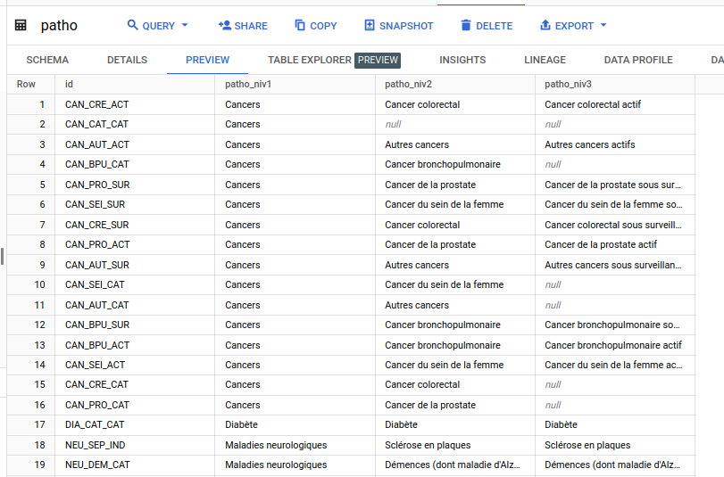
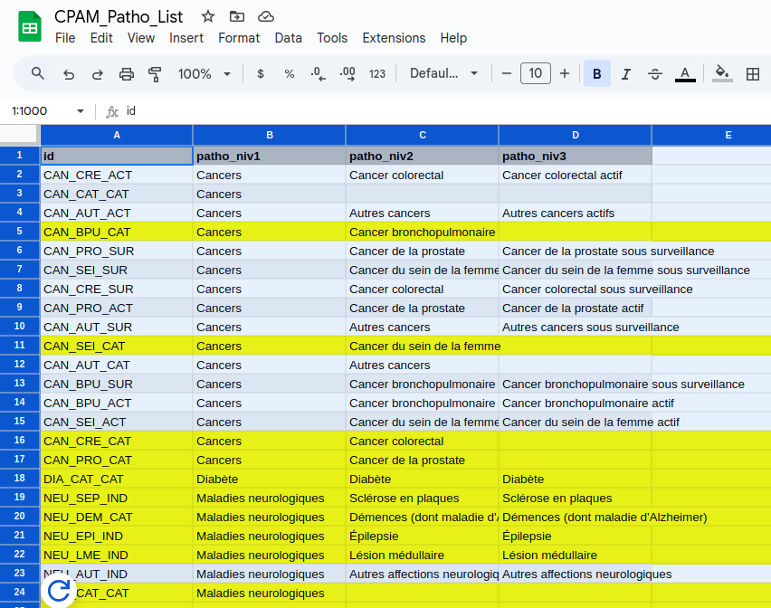
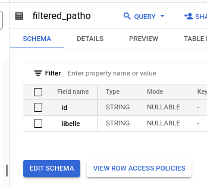
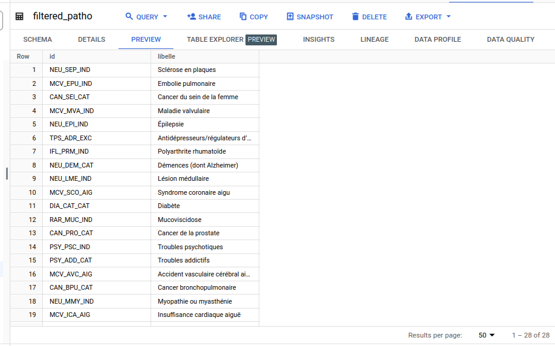
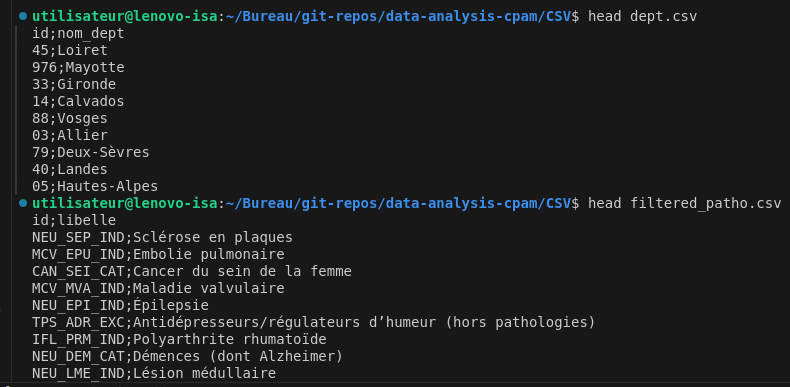

# Chapter 4: Analysis

Maintenant que mes données sont filtrées et organisées en trois tables dans BigQuery, il est temps de passer à l'analyse. 


## 1) Examen plus approfondi des pathologies répertoriées dans ce jeu de données

Grâce à la division des tables, il est facile désormais d'examiner la liste des patholgies dans la table `patho`.
Pour rappel, cette table contient 77 lignes et 4 colonnes (`id`, `patho_niv1`, `patho_niv2`, `patho_niv3`). Je remarque que les colonnes `id` et `patho_niv1` sont entièrement remplies. En revanche, les colonnes `patho_niv2` et `patho_niv3` contiennent des valeurs nulles, comme observé précédemment.




Ces valeurs nulles correspondent à des pathologies sans sous-catégories (ce qui est souvent le cas dans les bases de données médicales) et ne reflètent pas un manque de données, mais plutôt l'absence de sous-division. De plus, je remarque que l'identifiant technique dans la colonne `id` inclut la chaîne 'CAT' pour décrire les pathologies de niv2 ou niv3 qui contiennent des valeurs nulles.

Exemples :

Id            |  Libellés |
--------------|-----------|
`CAT_CRE_ACT` | Cancers (niv1) / Cancer colorectal (niv2) / Cancer colorectal actif (niv3) |
`CAN_CAT_CAT` | Cancers (niv1) / Null (niv2) / Null (niv3) |


Pour y voir plus clair, je fais un `Export` / `Explore with Sheets` depuis BigQuery pour ouvrir cette table dans Google Sheets, où je surligne les pathologies qui m'intéressent pour mon analyse exploratoire. 




Pour filtrer encore mes données, je vais mettre à jour la table `patho` pour ne garder que les lignes que j'ai surlignées dans Google Sheets, et qui correspondent à une `patho.id` unique. Je vais ensuite supprimer les colonnes redondantes `patho_niv1`, `patho_niv2` et `patho_niv3`, et ajouter une colonne `libelle` qui contiendra un libellé clair de la pathologie en question.

Les pathologies que je vais garder sont celles-ci, avec leur nouveau libellé dans `libelle` :

| Code        | Libellé                                                   |
|-------------|-----------------------------------------------------------|
| CAN_BPU_CAT | Cancer bronchopulmonaire                                  |
| CAN_SEI_CAT | Cancer du sein de la femme                                |
| CAN_CRE_CAT | Cancer colorectal                                         |
| CAN_PRO_CAT | Cancer de la prostate                                     |
| DIA_CAT_CAT | Diabète                                                   |
| NEU_SEP_IND | Sclérose en plaques                                       |
| NEU_DEM_CAT | Démences (dont Alzheimer)                                 |
| NEU_EPI_IND | Épilepsie                                                 |
| NEU_LME_IND | Lésion médullaire                                         |
| NEU_PRK_IND | Maladie de Parkinson                                      |
| NEU_MMY_IND | Myopathie ou myasthénie                                   |
| PSY_PSC_IND | Troubles psychotiques                                     |
| PSY_ADD_CAT | Troubles addictifs                                        |
| INF_COV_HOS | Hospitalisation pour Covid-19                             |
| MCV_SCO_CAT | Maladie coronaire                                         |
| MCV_AVC_AIG | Accident vasculaire cérébral aigu                         |
| MCV_ICA_AIG | Insuffisance cardiaque aiguë                              |
| MCV_SCO_AIG | Syndrome coronaire aigu                                   |
| MCV_EPU_IND | Embolie pulmonaire                                        |
| MCV_ICA_CAT | Insuffisance cardiaque                                    |
| MCV_MVA_IND | Maladie valvulaire                                        |
| IRT_DCH_CAT | Dialyse chronique                                         |
| TPS_ADR_EXC | Antidépresseurs/régulateurs d’humeur (hors pathologies)   |
| TPS_ANX_EXC | Anxiolytiques (hors pathologies)                          |
| IFL_PRM_IND | Polyarthrite rhumatoïde                                   |
| RAR_MUC_IND | Mucoviscidose                                             |
| IFL_MIC_IND | Maladies inflammatoires chroniques intestinales           |
| RES_CAT_EXC | Maladies respiratoires chroniques (hors mucoviscidose)    |


C'est sans doute plus qu'il n'en faut pour ce projet personnel, mais je peux toujours explorer des pistes plus tard.

- Étape 1 : Création de la table `filtered_patho`

``` sql 
CREATE TABLE `alien-oarlock-428016-f3.french_cpam.filtered_patho` AS
SELECT id
FROM `alien-oarlock-428016-f3.french_cpam.patho`
WHERE id IN (
    'CAN_BPU_CAT', 'CAN_SEI_CAT', 'CAN_CRE_CAT', 'CAN_PRO_CAT', 'DIA_CAT_CAT', 'NEU_SEP_IND',
    'NEU_DEM_CAT', 'NEU_EPI_IND', 'NEU_LME_IND', 'NEU_PRK_IND', 'NEU_MMY_IND', 'PSY_PSC_IND',
    'PSY_ADD_CAT', 'INF_COV_HOS', 'MCV_SCO_CAT', 'MCV_AVC_AIG', 'MCV_ICA_AIG', 'MCV_SCO_AIG',
    'MCV_EPU_IND', 'MCV_ICA_CAT', 'MCV_MVA_IND', 'IRT_DCH_CAT', 'TPS_ADR_EXC', 'TPS_ANX_EXC',
    'IFL_PRM_IND', 'RAR_MUC_IND', 'IFL_MIC_IND', 'RES_CAT_EXC'
);

```

- Étape 2 : Ajout d'une colonne `libelle` et mise à jour des libellés avec Python

Comme il est facile d'intégrer un script Python dans un notebook de Google Query, j'exécute le script Python suivant pour ajouter et remplir une nouvelle colonne `libelle` dans la table `filtered_patho` :

``` python
from google.cloud import bigquery
import pandas as pd

# Initialiser le client BigQuery
client = bigquery.Client()

# Lire la table BigQuery dans un dataframe
query = """
    SELECT * FROM `alien-oarlock-428016-f3.french_cpam.filtered_patho`
"""
df = client.query(query).to_dataframe()

# Ajouter la colonne `libelle` en fonction des critères
df['libelle'] = df['id'].map({
    "CAN_BPU_CAT": "Cancer bronchopulmonaire",
    "CAN_SEI_CAT": "Cancer du sein de la femme",
    "CAN_CRE_CAT": "Cancer colorectal",
    "CAN_PRO_CAT": "Cancer de la prostate",
    "DIA_CAT_CAT": "Diabète",
    "NEU_SEP_IND": "Sclérose en plaques",
    "NEU_DEM_CAT": "Démences (dont Alzheimer)",
    "NEU_EPI_IND": "Épilepsie",
    "NEU_LME_IND": "Lésion médullaire",
    "NEU_PRK_IND": "Maladie de Parkinson",
    "NEU_MMY_IND": "Myopathie ou myasthénie",
    "PSY_PSC_IND": "Troubles psychotiques",
    "PSY_ADD_CAT": "Troubles addictifs",
    "INF_COV_HOS": "Hospitalisation pour Covid-19",
    "MCV_SCO_CAT": "Maladie coronaire",
    "MCV_AVC_AIG": "Accident vasculaire cérébral aigu",
    "MCV_ICA_AIG": "Insuffisance cardiaque aiguë",
    "MCV_SCO_AIG": "Syndrome coronaire aigu",
    "MCV_EPU_IND": "Embolie pulmonaire",
    "MCV_ICA_CAT": "Insuffisance cardiaque",
    "MCV_MVA_IND": "Maladie valvulaire",
    "IRT_DCH_CAT": "Dialyse chronique",
    "TPS_ADR_EXC": "Antidépresseurs/régulateurs d’humeur (hors pathologies)",
    "TPS_ANX_EXC": "Anxiolytiques (hors pathologies)",
    "IFL_PRM_IND": "Polyarthrite rhumatoïde",
    "RAR_MUC_IND": "Mucoviscidose",
    "IFL_MIC_IND": "Maladies inflammatoires chroniques intestinales",
    "RES_CAT_EXC": "Maladies respiratoires chroniques (hors mucoviscidose)"
})

# Remplacer les valeurs NaN par une chaîne vide si nécessaire
df['libelle'].fillna('', inplace=True)

# Charger les données mises à jour dans BigQuery
table_id = "alien-oarlock-428016-f3.french_cpam.filtered_patho"

job_config = bigquery.LoadJobConfig(
    write_disposition=bigquery.WriteDisposition.WRITE_TRUNCATE
)

# Charger le dataframe dans la table BigQuery
job = client.load_table_from_dataframe(df, table_id, job_config=job_config)
job.result()  # Attendre la fin de l'upload

print("Table mise à jour avec succès dans BigQuery.")

```

La table `filtered_patho` est bien créée et remplie comme il faut, avec 2 colonnes et 28 rangées : 






## 2) Prévalence des pathologies selon les départements

Puisque l'obectif de cette analyse exploratoire des données est de répondre à trois questions : 1) analyser la prévalence des pathologies selon les départements en 2022, 2) voir l'évolution de ces pathologies de 2015 à 2022, et 3) voir si la vague Covid 2019-2020 a eu un impact sur ces pathologies, commençons par analyser la prévalence de certaines pathologies spécifiques en 2022.


### Prévalence du cancer du poumon en France en 2022

``` sql 
SELECT 
    ps.prev,
    fp.libelle,
    d.id,
    d.nom_dept,
    
FROM `alien-oarlock-428016-f3.french_cpam.patient_stat` as ps
JOIN `alien-oarlock-428016-f3.french_cpam.filtered_patho` as fp
ON ps.patho_id = fp.id
JOIN `alien-oarlock-428016-f3.french_cpam.dept` as d
ON ps.dept_id = d.id

WHERE ps.annee = 2022
AND   ps.age = "tsage"
AND   ps.sex = 9            -- tous sexes confondus
AND   fp.id = "CAN_BPU_CAT" -- code pour le cancer bronchopumonaire
AND   d.id != "999"         -- pour éviter les doublons avec l'agrégation des départements

ORDER BY ps.prev DESC
LIMIT 10 ;
```

Résultat :

| Row | prev | libelle                | id | nom_dept           |
|-----|------|-------------------------|----|---------------------|
| 1   | 0.411| Cancer bronchopulmonaire | 2A | Corse-du-Sud       |
| 2   | 0.406| Cancer bronchopulmonaire | 2B | Haute-Corse        |
| 3   | 0.351| Cancer bronchopulmonaire | 08 | Ardennes           |
| 4   | 0.340| Cancer bronchopulmonaire | 58 | Nièvre             |
| 5   | 0.338| Cancer bronchopulmonaire | 09 | Ariège             |
| 6   | 0.337| Cancer bronchopulmonaire | 55 | Meuse              |
| 7   | 0.331| Cancer bronchopulmonaire | 54 | Meurthe-et-Moselle |
| 8   | 0.329| Cancer bronchopulmonaire | 57 | Moselle            |
| 9   | 0.323| Cancer bronchopulmonaire | 83 | Var                |
| 10  | 0.322| Cancer bronchopulmonaire | 29 | Finistère          |


### Prévalence du cancer colorectal en France en 2022

``` sql 
SELECT 
    ps.prev,
    fp.libelle,
    d.id,
    d.nom_dept,
    
FROM `alien-oarlock-428016-f3.french_cpam.patient_stat` as ps
JOIN `alien-oarlock-428016-f3.french_cpam.filtered_patho` as fp
ON ps.patho_id = fp.id
JOIN `alien-oarlock-428016-f3.french_cpam.dept` as d
ON ps.dept_id = d.id

WHERE ps.annee = 2022
AND   ps.age = "tsage"
AND   ps.sex = 9            -- tous sexes confondus
AND   fp.id = "CAN_CRE_CAT" -- code pour le cancer colorectal
AND   d.id != "999"         -- pour éviter les doublons avec l'agrégation des départements

ORDER BY ps.prev DESC
LIMIT 10 ;
```


Résultat:

| Row | prev | libelle           | id | nom_dept       |
|-----|------|--------------------|----|----------------|
| 1   | 0.929| Cancer colorectal | 81 | Tarn           |
| 2   | 0.810| Cancer colorectal | 23 | Creuse         |
| 3   | 0.795| Cancer colorectal | 29 | Finistère      |
| 4   | 0.793| Cancer colorectal | 46 | Lot            |
| 5   | 0.773| Cancer colorectal | 58 | Nièvre         |
| 6   | 0.747| Cancer colorectal | 11 | Aude           |
| 7   | 0.737| Cancer colorectal | 36 | Indre          |
| 8   | 0.734| Cancer colorectal | 10 | Aube           |
| 9   | 0.729| Cancer colorectal | 03 | Allier         |
| 10  | 0.728| Cancer colorectal | 12 | Aveyron        |


### Prévalence du cancer du sein en France en 2022

``` sql 
SELECT 
    ps.prev,
    fp.libelle,
    d.id,
    d.nom_dept,
    
FROM `alien-oarlock-428016-f3.french_cpam.patient_stat` as ps
JOIN `alien-oarlock-428016-f3.french_cpam.filtered_patho` as fp
ON ps.patho_id = fp.id
JOIN `alien-oarlock-428016-f3.french_cpam.dept` as d
ON ps.dept_id = d.id

WHERE ps.annee = 2022
AND   ps.age = "tsage"
AND   ps.sex = 2            -- cancer du sein exclusivemnt féminin
AND   fp.id = "CAN_SEI_CAT" -- code pour le cancer du sein
AND   d.id != "999"         -- pour éviter les doublons avec l'agrégation des départements

ORDER BY ps.prev DESC
LIMIT 10 ;
```


Résultat:

| Row | prev | libelle                     | id | nom_dept           |
|-----|------|------------------------------|----|---------------------|
| 1   | 2.712 | Cancer du sein de la femme   | 58 | Nièvre             |
| 2   | 2.7   | Cancer du sein de la femme   | 03 | Allier             |
| 3   | 2.668 | Cancer du sein de la femme   | 57 | Moselle            |
| 4   | 2.632 | Cancer du sein de la femme   | 2A | Corse-du-Sud       |
| 5   | 2.604 | Cancer du sein de la femme   | 23 | Creuse             |
| 6   | 2.583 | Cancer du sein de la femme   | 87 | Haute-Vienne       |
| 7   | 2.548 | Cancer du sein de la femme   | 15 | Cantal             |
| 8   | 2.458 | Cancer du sein de la femme   | 52 | Haute-Marne        |
| 9   | 2.448 | Cancer du sein de la femme   | 17 | Charente-Maritime  |
| 10  | 2.441 | Cancer du sein de la femme   | 46 | Lot               |


### Prévalence du cancer de la prostate en France en 2022

``` sql 
SELECT 
    ps.prev,
    fp.libelle,
    d.id,
    d.nom_dept,
    
FROM `alien-oarlock-428016-f3.french_cpam.patient_stat` as ps
JOIN `alien-oarlock-428016-f3.french_cpam.filtered_patho` as fp
ON ps.patho_id = fp.id
JOIN `alien-oarlock-428016-f3.french_cpam.dept` as d
ON ps.dept_id = d.id

WHERE ps.annee = 2022
AND   ps.age = "tsage"
AND   ps.sex = 1             -- cancer prostate exclusivemnt masculin
AND   fp.id = "CAN_PRO_CAT"  -- code pour le cancer de la prostate
AND   d.id != "999"          -- pour éviter les doublons avec l'agrégation des départements

ORDER BY ps.prev DESC
LIMIT 10 ;
```


Résultat:

| Row | prev  | libelle               | id  | nom_dept          |
|-----|-------|------------------------|-----|--------------------|
| 1   | 3.206 | Cancer de la prostate  | 972 | Martinique        |
| 2   | 3.161 | Cancer de la prostate  | 971 | Guadeloupe        |
| 3   | 3.003 | Cancer de la prostate  | 23  | Creuse            |
| 4   | 2.858 | Cancer de la prostate  | 15  | Cantal            |
| 5   | 2.704 | Cancer de la prostate  | 87  | Haute-Vienne      |
| 6   | 2.607 | Cancer de la prostate  | 03  | Allier            |
| 7   | 2.473 | Cancer de la prostate  | 24  | Dordogne          |
| 8   | 2.432 | Cancer de la prostate  | 36  | Indre             |
| 9   | 2.416 | Cancer de la prostate  | 17  | Charente-Maritime |
| 10  | 2.405 | Cancer de la prostate  | 52  | Haute-Marne       |


### Prévalence du diabète en France en 2022

``` sql 
SELECT 
    ps.prev,
    fp.libelle,
    d.id,
    d.nom_dept,
    
FROM `alien-oarlock-428016-f3.french_cpam.patient_stat` as ps
JOIN `alien-oarlock-428016-f3.french_cpam.filtered_patho` as fp
ON ps.patho_id = fp.id
JOIN `alien-oarlock-428016-f3.french_cpam.dept` as d
ON ps.dept_id = d.id

WHERE ps.annee = 2022
AND   ps.age = "tsage"
AND   ps.sex = 9             -- tous sexes confondus
AND   fp.id = "DIA_CAT_CAT"  -- code pour le diabète
AND   d.id != "999"          -- pour éviter les doublons avec l'agrégation des départements

ORDER BY ps.prev DESC
LIMIT 10 ;
```


Résultat:

| Row | prev   | libelle | id  | nom_dept        |
|-----|--------|---------|-----|-----------------|
| 1   | 11.274 | Diabète | 971 | Guadeloupe      |
| 2   | 10.526 | Diabète | 972 | Martinique      |
| 3   | 9.468  | Diabète | 58  | Nièvre          |
| 4   | 9.077  | Diabète | 974 | La Réunion      |
| 5   | 8.855  | Diabète | 23  | Creuse          |
| 6   | 8.386  | Diabète | 36  | Indre           |
| 7   | 8.217  | Diabète | 03  | Allier          |
| 8   | 8.183  | Diabète | 57  | Moselle         |
| 9   | 8.154  | Diabète | 02  | Aisne           |
| 10  | 8.134  | Diabète | 08  | Ardennes        |


### Prévalence de la sclérose en plaques en France en 2022

``` sql 
SELECT 
    ps.prev,
    fp.libelle,
    d.id,
    d.nom_dept,
    
FROM `alien-oarlock-428016-f3.french_cpam.patient_stat` as ps
JOIN `alien-oarlock-428016-f3.french_cpam.filtered_patho` as fp
ON ps.patho_id = fp.id
JOIN `alien-oarlock-428016-f3.french_cpam.dept` as d
ON ps.dept_id = d.id

WHERE ps.annee = 2022
AND   ps.age = "tsage"
AND   ps.sex = 9             -- tous sexes confondus
AND   fp.id = "NEU_SEP_IND"  -- code pour la sclérose en plaques
AND   d.id != "999"          -- pour éviter les doublons avec l'agrégation des départements

ORDER BY ps.prev DESC
LIMIT 10 ;
```


Résultat:

| Row | prev  | libelle              | id  | nom_dept            |
|-----|-------|-----------------------|-----|----------------------|
| 1   | 0.289 | Sclérose en plaques   | 90  | Territoire de Belfort|
| 2   | 0.274 | Sclérose en plaques   | 57  | Moselle             |
| 3   | 0.266 | Sclérose en plaques   | 52  | Haute-Marne         |
| 4   | 0.255 | Sclérose en plaques   | 55  | Meuse              |
| 5   | 0.247 | Sclérose en plaques   | 70  | Haute-Saône         |
| 6   | 0.247 | Sclérose en plaques   | 67  | Bas-Rhin           |
| 7   | 0.242 | Sclérose en plaques   | 54  | Meurthe-et-Moselle |
| 8   | 0.239 | Sclérose en plaques   | 08  | Ardennes           |
| 9   | 0.233 | Sclérose en plaques   | 21  | Côte-d'Or          |
| 10  | 0.233 | Sclérose en plaques   | 80  | Somme              |


### Prévalence des maladies du foie ou du pancréas (hors mucoviscidose) en France en 2022

``` sql 
SELECT 
    ps.prev,
    fp.libelle,
    d.id,
    d.nom_dept,
    
FROM `alien-oarlock-428016-f3.french_cpam.patient_stat` as ps
JOIN `alien-oarlock-428016-f3.french_cpam.filtered_patho` as fp
ON ps.patho_id = fp.id
JOIN `alien-oarlock-428016-f3.french_cpam.dept` as d
ON ps.dept_id = d.id

WHERE ps.annee = 2022
AND   ps.age = "tsage"
AND   ps.sex = 9             -- tous sexes confondus
AND   fp.id = "MFP_CAT_EXC"  -- code pour les maladies du foie et du pancréas
AND   d.id != "999"          -- pour éviter les doublons avec l'agrégation des départements

ORDER BY ps.prev DESC
LIMIT 10 ;
```

Oups. La requête ne retourne aucun résultat ! J'ai oublié d'ajouter ce code et ce libellé de pathologie dans ma table `filtered_patho`.
Pour réparer cela je fais un INSERT INTO dans la table `filtered_patho` avec les nouvelles valeurs de (id, libelle) que je veux ajouter :

``` sql
INSERT INTO `alien-oarlock-428016-f3.french_cpam.filtered_patho` (id, libelle)
VALUES ("MFP_CAT_EXC", "Maladies du foie ou du pancréas (hors mucoviscidose)");
```
Ça marche ! 
La table `filtered_patho` contient désormais 29 lignes, avec la rangée pour les maladies du foie et du pancréas bien insérée.


Je reprends la requête SQL précédente pour afficher la prévalence des maladies du foie et du pancréas en 2022.

Résultat:

| Row | prev  | libelle                                          | id  | nom_dept                  |
|-----|-------|--------------------------------------------------|-----|----------------------------|
| 1   | 1.175 | Maladies du foie ou du pancréas (hors mucoviscidose) | 87  | Haute-Vienne              |
| 2   | 1.13  | Maladies du foie ou du pancréas (hors mucoviscidose) | 23  | Creuse                    |
| 3   | 1.129 | Maladies du foie ou du pancréas (hors mucoviscidose) | 86  | Vienne                    |
| 4   | 1.11  | Maladies du foie ou du pancréas (hors mucoviscidose) | 55  | Meuse                     |
| 5   | 1.022 | Maladies du foie ou du pancréas (hors mucoviscidose) | 58  | Nièvre                    |
| 6   | 1.014 | Maladies du foie ou du pancréas (hors mucoviscidose) | 2A  | Corse-du-Sud              |
| 7   | 1.009 | Maladies du foie ou du pancréas (hors mucoviscidose) | 11  | Aude                      |
| 8   | 1.001 | Maladies du foie ou du pancréas (hors mucoviscidose) | 04  | Alpes-de-Haute-Provence   |
| 9   | 1.0   | Maladies du foie ou du pancréas (hors mucoviscidose) | 52  | Haute-Marne               |
| 10  | 0.995 | Maladies du foie ou du pancréas (hors mucoviscidose) | 15  | Cantal                    |


### Prévalence de la maladie de Parkinson en France en 2022

``` sql 
SELECT 
    ps.prev,
    fp.libelle,
    d.id,
    d.nom_dept,
    
FROM `alien-oarlock-428016-f3.french_cpam.patient_stat` as ps
JOIN `alien-oarlock-428016-f3.french_cpam.filtered_patho` as fp
ON ps.patho_id = fp.id
JOIN `alien-oarlock-428016-f3.french_cpam.dept` as d
ON ps.dept_id = d.id

WHERE ps.annee = 2022
AND   ps.age = "tsage"
AND   ps.sex = 9             -- tous sexes confondus
AND   fp.id = "NEU_PRK_IND"  -- code pour la maladie de Parkinson
AND   d.id != "999"          -- pour éviter les doublons avec l'agrégation des départements

ORDER BY ps.prev DESC
LIMIT 10 ;
```

Résultat:

| Row | prev  | libelle                | id  | nom_dept         |
|-----|-------|-------------------------|-----|------------------|
| 1   | 0.72  | Maladie de Parkinson    | 36  | Indre           |
| 2   | 0.694 | Maladie de Parkinson    | 48  | Lozère          |
| 3   | 0.659 | Maladie de Parkinson    | 12  | Aveyron         |
| 4   | 0.641 | Maladie de Parkinson    | 15  | Cantal          |
| 5   | 0.634 | Maladie de Parkinson    | 19  | Corrèze         |
| 6   | 0.633 | Maladie de Parkinson    | 23  | Creuse          |
| 7   | 0.601 | Maladie de Parkinson    | 16  | Charente        |
| 8   | 0.592 | Maladie de Parkinson    | 71  | Saône-et-Loire  |
| 9   | 0.59  | Maladie de Parkinson    | 46  | Lot             |
| 10  | 0.578 | Maladie de Parkinson    | 52  | Haute-Marne     |


### Prévalence des démences (dont maladie d'Alzheimer) en France en 2022

``` sql 
SELECT 
    ps.prev,
    fp.libelle,
    d.id,
    d.nom_dept,
    
FROM `alien-oarlock-428016-f3.french_cpam.patient_stat` as ps
JOIN `alien-oarlock-428016-f3.french_cpam.filtered_patho` as fp
ON ps.patho_id = fp.id
JOIN `alien-oarlock-428016-f3.french_cpam.dept` as d
ON ps.dept_id = d.id

WHERE ps.annee = 2022
AND   ps.age = "tsage"
AND   ps.sex = 9             -- tous sexes confondus
AND   fp.id = "NEU_DEM_CAT"  -- code pour les démences (dont maladie d'Alzheimer)
AND   d.id != "999"          -- pour éviter les doublons avec l'agrégation des départements

ORDER BY ps.prev DESC
LIMIT 10 ;
```

Résultat:

| Row | prev  | libelle                     | id  | nom_dept       |
|-----|-------|------------------------------|-----|----------------|
| 1   | 1.601 | Démences (dont Alzheimer)    | 12  | Aveyron        |
| 2   | 1.515 | Démences (dont Alzheimer)    | 15  | Cantal         |
| 3   | 1.513 | Démences (dont Alzheimer)    | 58  | Nièvre         |
| 4   | 1.504 | Démences (dont Alzheimer)    | 19  | Corrèze        |
| 5   | 1.488 | Démences (dont Alzheimer)    | 46  | Lot            |
| 6   | 1.47  | Démences (dont Alzheimer)    | 87  | Haute-Vienne   |
| 7   | 1.468 | Démences (dont Alzheimer)    | 48  | Lozère         |
| 8   | 1.395 | Démences (dont Alzheimer)    | 32  | Gers           |
| 9   | 1.385 | Démences (dont Alzheimer)    | 57  | Moselle        |
| 10  | 1.377 | Démences (dont Alzheimer)    | 81  | Tarn           |


Le résultat de ces analyses sont confirmés par le propre site de la CPAM, donc tout est parfait.

Il est temps de faire des visualisations dans Tableau. Pour cela, je transfère mes trois tables `dept`, `filtered_patho` et `patient_stat` dans Google Cloud Storage (GCS), où je peux ensuite télécharger les trois fichiers CSV correspondants sur mon PC local.
Ensuite j'importe ces trois fichiers CSV dans Tableau.

Problème : la version français de mon Tableau Desktop ne reconnaît pas les fichiers .csv qui sont délimités par une virgule. Je dois d'abord remplacer la virgule par un point-virgule, par exemple en ligne de commande, en prenant soin de faire une sauvegarde de mes fichiers initiaux au cas où :

``` shell
cp dept.csv dept.old.csv
cp filtered_patho.csv filtered_patho.old.csv
cp patient_stat.csv patient_stat.old.csv
sed -i 's/,/;/g' dept.csv filtered_patho.csv patient_stat.csv

```

Je vérifie avec head :

``` bash
head dept.csv
head filtered_patho.csv
head patient_stat.csv
```



Tout marche ! Tout devrait être bon désormais pour des visualisations dans Tableau.


## 3) Conseils pour réussir ses visualisations dans Tableau 

Suite à des écueils que j'ai rencontrés et résolus dans Tableau, voici des rappels essentiels pour réussir des visualisations :

- Ne pas conserver des valeurs agrégées dans les codes de régions ou départements

Tableau ne comprendra pas la valeur `999` dans les codes INSEE des départements, à côté de `64`, `40`, etc. et affichera une erreur.

- Ajouter un champ avec le nom des départements en toutes lettres

Pour faire comprendre à Tableau que les codes correspondent aux départements français, je conseille d'ajouter une colonne contenant le nom des départements en toutes lettres. Par exemple, `Pyrénées-Atlantiques`, `Landes`, etc.

- Définir le type des codes de départements en `Rôle géographique` / `Comté`

Ça permet d'afficher la carte de France dès qu'on ajoute ces codes de départements dans le Canevas.

- Désactiver `Agréger les données` dans le menu `Analyse`

Ça permet d'éviter que les prévalences ou autres paramètres soient automatiquement agrégés et additionnés quand on les place dans le Canevas.

- Effectuer des jointures de tables (physiques) plutôt que des relations de tables (logiques)

Ça permet d'éviter des problèmes bizarres tels que l'option `Agréger les données` en grisé et automatiquement activée.

- Pour les pays comme la France possédant des territoires outre-mer, créer un feuillet (sheet) pour chaque département d'outre-mer, puis assembler tous les départements DOM-TOM avec la métropole dans un tableau de bord (dashboard) final. 

- Utiliser des Champs personnalisés dès qu'une variable ne correspond pas complètement aux attentes, ça simplifie vraiment la vie.

Exemples :

-- Champ personnalisé pour rendre la variable `Annee` qui était de type numérique en variable `Annee Date` de type date

``` shell 
Nom du champ personnalisé : Annee Date
MAKEDATE([Annee], 1, 1)
```

-- Champ personnalisé pour faire un histogramme avec les valeurs des effectifs féminins sur la gauche (par rapport à ceux des hommes à droite)

D'abord caster la variable `sex` en entier

``` shell
Nom du champ personnalisé : "Sex Num"
INT([sex]=)
```

Puis changer `Ntop` en `Ntop inversé`

``` shell
Nom du champ personnalisé : "Ntop inversé"
IF ([Sex Num] = 2) THEN -[Ntop]
ELSEIF ([Sex Num] = 1) THEN [Ntop]
END
```

## 4) Scripts Python utilisés dans un notebook BigQuery

Pour approfondir l'analyse exploratoire des données, j'ai tracé la courbe des prévalences pour les "Top 4" et "Bottom 4" départements de 2015 à 2022, pour les quatre cancers les plus répandus en France, en les comparant à la médiane nationale.

### Cancer du poumon

Échantillon de code en Python

``` python
from google.cloud import bigquery
import pandas as pd
import matplotlib.pyplot as plt
import seaborn as sns

# Initialiser le client BigQuery
client = bigquery.Client()

# Définir les départements Top 4 et Bottom 4 en 2022 pour la pathologie en question
departements_top4 = ['Corse-du-Sud', 'Haute-Corse', 'Ardennes', 'Nièvre']
departements_bottom4 = ["Mayotte", "Guyane", "Guadeloupe", "Martinique"]
departements_cibles = departements_top4 + departements_bottom4

# Définir les paramètres
cancer_id = "CAN_BPU_CAT"  # Catégorie de cancer spécifique
annees = list(range(2015, 2023))  # 2015 à 2022
sexe = 9  # tous sexes
age = "tsage"  # Tranche d'âge spécifique

# Requête SQL pour les départements Top 4 et Bottom 4
sql_cibles = f"""
SELECT 
    ps.prev,
    fp.libelle AS pathologie,
    d.id AS dept_id,
    d.nom_dept,
    ps.annee,
    ps.sex,
    ps.age
FROM `alien-oarlock-428016-f3.french_cpam.patient_stat` AS ps
JOIN `alien-oarlock-428016-f3.french_cpam.filtered_patho` AS fp
    ON ps.patho_id = fp.id
JOIN `alien-oarlock-428016-f3.french_cpam.dept` AS d
    ON ps.dept_id = d.id
WHERE ps.annee BETWEEN @start_year AND @end_year
    AND ps.age = @age
    AND ps.sex = @sexe
    AND fp.id = @cancer_id
    AND d.nom_dept IN UNNEST(@departements_cibles)
    AND d.id != "999"
ORDER BY ps.annee, d.nom_dept;
"""

# Préparer les paramètres de la requête
job_config_cibles = bigquery.QueryJobConfig(
    query_parameters=[
        bigquery.ScalarQueryParameter("start_year", "INT64", 2015),
        bigquery.ScalarQueryParameter("end_year", "INT64", 2022),
        bigquery.ScalarQueryParameter("age", "STRING", age),
        bigquery.ScalarQueryParameter("sexe", "INT64", sexe),
        bigquery.ScalarQueryParameter("cancer_id", "STRING", cancer_id),
        bigquery.ArrayQueryParameter("departements_cibles", "STRING", departements_cibles)
    ]
)

# Exécuter la requête et récupérer les données dans un dataframe
df_cibles = client.query(sql_cibles, job_config=job_config_cibles).to_dataframe()

```

Graphe :


### Cancer colorectal

Échantillon de code en Python

``` python
from google.cloud import bigquery
import pandas as pd
import matplotlib.pyplot as plt
import seaborn as sns

# Initialiser le client BigQuery
client = bigquery.Client()

# Définir les départements Top 4 et Bottom 4 en 2022 pour la pathologie en question
departements_top4 = ['Tarn', 'Creuse', 'Finistère', 'Lot']
departements_bottom4 = ["Mayotte", "Guyane", "La Réunion", "Seine-Saint-Denis"]
departements_cibles = departements_top4 + departements_bottom4

# Définir les paramètres
cancer_id = "CAN_CRE_CAT"  # Catégorie de cancer spécifique
annees = list(range(2015, 2023))  # 2015 à 2022
sexe = 9  # tous sexes
age = "tsage"  # Tranche d'âge spécifique

# Requête SQL pour les départements Top 4 et Bottom 4
sql_cibles = f"""
SELECT 
    ps.prev,
    fp.libelle AS pathologie,
    d.id AS dept_id,
    d.nom_dept,
    ps.annee,
    ps.sex,
    ps.age
FROM `alien-oarlock-428016-f3.french_cpam.patient_stat` AS ps
JOIN `alien-oarlock-428016-f3.french_cpam.filtered_patho` AS fp
    ON ps.patho_id = fp.id
JOIN `alien-oarlock-428016-f3.french_cpam.dept` AS d
    ON ps.dept_id = d.id
WHERE ps.annee BETWEEN @start_year AND @end_year
    AND ps.age = @age
    AND ps.sex = @sexe
    AND fp.id = @cancer_id
    AND d.nom_dept IN UNNEST(@departements_cibles)
    AND d.id != "999"
ORDER BY ps.annee, d.nom_dept;
"""

# Préparer les paramètres de la requête
job_config_cibles = bigquery.QueryJobConfig(
    query_parameters=[
        bigquery.ScalarQueryParameter("start_year", "INT64", 2015),
        bigquery.ScalarQueryParameter("end_year", "INT64", 2022),
        bigquery.ScalarQueryParameter("age", "STRING", age),
        bigquery.ScalarQueryParameter("sexe", "INT64", sexe),
        bigquery.ScalarQueryParameter("cancer_id", "STRING", cancer_id),
        bigquery.ArrayQueryParameter("departements_cibles", "STRING", departements_cibles)
    ]
)

# Exécuter la requête et récupérer les données dans un dataframe
df_cibles = client.query(sql_cibles, job_config=job_config_cibles).to_dataframe()

```

Graphe :


### Cancer du sein

Échantillon de code Python :

``` python
from google.cloud import bigquery
import pandas as pd
import matplotlib.pyplot as plt
import seaborn as sns

# Initialiser le client BigQuery
client = bigquery.Client()

# Définir les départements Top 4 et Bottom 4 en 2022 pour la pathologie en question
departements_top4 = ['Nièvre', 'Allier', 'Moselle', 'Corse-du-Sud']
departements_bottom4 = ["Mayotte", "Guyane", "La Réunion", "Martinique"]
departements_cibles = departements_top4 + departements_bottom4

# Définir les paramètres
cancer_id = "CAN_SEI_CAT"  # Catégorie de cancer spécifique
annees = list(range(2015, 2023))  # 2015 à 2022
sexe = 2  # féminin
age = "tsage"  # Tranche d'âge spécifique

# Requête SQL pour les départements Top 4 et Bottom 4
sql_cibles = f"""
SELECT 
    ps.prev,
    fp.libelle AS pathologie,
    d.id AS dept_id,
    d.nom_dept,
    ps.annee,
    ps.sex,
    ps.age
FROM `alien-oarlock-428016-f3.french_cpam.patient_stat` AS ps
JOIN `alien-oarlock-428016-f3.french_cpam.filtered_patho` AS fp
    ON ps.patho_id = fp.id
JOIN `alien-oarlock-428016-f3.french_cpam.dept` AS d
    ON ps.dept_id = d.id
WHERE ps.annee BETWEEN @start_year AND @end_year
    AND ps.age = @age
    AND ps.sex = @sexe
    AND fp.id = @cancer_id
    AND d.nom_dept IN UNNEST(@departements_cibles)
    AND d.id != "999"
ORDER BY ps.annee, d.nom_dept;
"""

# Préparer les paramètres de la requête
job_config_cibles = bigquery.QueryJobConfig(
    query_parameters=[
        bigquery.ScalarQueryParameter("start_year", "INT64", 2015),
        bigquery.ScalarQueryParameter("end_year", "INT64", 2022),
        bigquery.ScalarQueryParameter("age", "STRING", age),
        bigquery.ScalarQueryParameter("sexe", "INT64", sexe),
        bigquery.ScalarQueryParameter("cancer_id", "STRING", cancer_id),
        bigquery.ArrayQueryParameter("departements_cibles", "STRING", departements_cibles)
    ]
)

# Exécuter la requête et récupérer les données dans un dataframe
df_cibles = client.query(sql_cibles, job_config=job_config_cibles).to_dataframe()

```

Graphe :


### Cancer de la prostate 

Échantillon de code Python :

``` python
from google.cloud import bigquery
import pandas as pd
import matplotlib.pyplot as plt
import seaborn as sns

# Initialiser le client BigQuery
client = bigquery.Client()

# Définir les départements Top 4 et Bottom 4 en 2022 pour la pathologie en question
departements_top4 = ['Martinique', 'Guadeloupe', 'Creuse', 'Cantal']
departements_bottom4 = ["Mayotte", "Guyane", "La Réunion", "Seine-Saint-Denis"]
departements_cibles = departements_top4 + departements_bottom4

# Définir les paramètres
cancer_id = "CAN_PRO_CAT"  # Catégorie de cancer spécifique
annees = list(range(2015, 2023))  # 2015 à 2022
sexe = 1  # masculin
age = "tsage"  # Tranche d'âge spécifique

# Requête SQL pour les départements Top 4 et Bottom 4
sql_cibles = f"""
SELECT 
    ps.prev,
    fp.libelle AS pathologie,
    d.id AS dept_id,
    d.nom_dept,
    ps.annee,
    ps.sex,
    ps.age
FROM `alien-oarlock-428016-f3.french_cpam.patient_stat` AS ps
JOIN `alien-oarlock-428016-f3.french_cpam.filtered_patho` AS fp
    ON ps.patho_id = fp.id
JOIN `alien-oarlock-428016-f3.french_cpam.dept` AS d
    ON ps.dept_id = d.id
WHERE ps.annee BETWEEN @start_year AND @end_year
    AND ps.age = @age
    AND ps.sex = @sexe
    AND fp.id = @cancer_id
    AND d.nom_dept IN UNNEST(@departements_cibles)
    AND d.id != "999"
ORDER BY ps.annee, d.nom_dept;
"""

# Préparer les paramètres de la requête
job_config_cibles = bigquery.QueryJobConfig(
    query_parameters=[
        bigquery.ScalarQueryParameter("start_year", "INT64", 2015),
        bigquery.ScalarQueryParameter("end_year", "INT64", 2022),
        bigquery.ScalarQueryParameter("age", "STRING", age),
        bigquery.ScalarQueryParameter("sexe", "INT64", sexe),
        bigquery.ScalarQueryParameter("cancer_id", "STRING", cancer_id),
        bigquery.ArrayQueryParameter("departements_cibles", "STRING", departements_cibles)
    ]
)

# Exécuter la requête et récupérer les données dans un dataframe
df_cibles = client.query(sql_cibles, job_config=job_config_cibles).to_dataframe()

```

Graphe :

